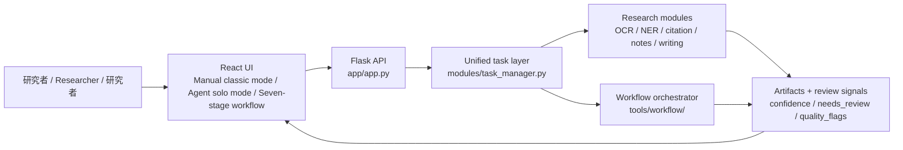

# 历史研究 AI 工作流设计

> 当前版本: 2026-04-28
> 状态: 后端、React 前端与 Windows 安装程序整合后的根目录工作流索引。详细阶段协议仍保存在 `docs/workflow/`。

## 设计目标

工作流服务于“历史研究 AI / History Research AI / 歴史研究AI”的核心目标：让研究者在同一 UI 中完成材料搜集、史料整理、OCR/NER、史料考证、写作、润色、引文格式化和最终输出，同时保留人工复核、断点恢复与归档证据。

核心约束:

- 本地优先；外部 API、本地 LLM、MCP、skill 等后端都必须是可替换增强层。
- 前端只编排、展示和保存必要脱敏状态；真实密钥、私密史料和敏感路径留在后端或本地受控入口。
- 所有长任务都进入 `任务中心 / Task center / タスクセンター`，保留进度、日志、产物和复核项。
- 每个任务结果都尽量保留 `backend/provider/model/confidence/needs_review/quality_flags/artifacts`。
- Windows 安装版与源码运行版使用同一 Flask API；安装版由 Flask 托管构建后的 React 前端。

## 整合后运行链路

## UI 到工作流的映射

| UI 名称 | 前端用途 | 后端契约 |
| --- | --- | --- |
| 全手动经典模式 / Manual classic mode / 手動クラシックモード | 逐项选择模块、backend、provider、输入和输出。 | 优先调用 `/api/tasks/capabilities` 与 `/api/tasks/execute`，返回 `task_execution` envelope。 |
| AI agent solo 模式 / AI agent solo mode / AIエージェントsoloモード | agent 先生成计划，再按授权调用任务；高风险步骤请求确认。 | 通过 workspace skill、任务注册表和 package/envelope 协议限制可调用能力。 |
| 七阶段工作流 / Seven-stage workflow / 七段階ワークフロー | 按历史研究流程推进项目，并把 checkpoint 写入任务中心。 | 由 `tools/workflow/workflow_orchestrator.py` 与 `ResearchProject` 登记 stage metadata。 |
| 自由工作流编排 / Free workflow builder / 自由ワークフロー編成 | 从模块目录拖选能力，形成可执行蓝图。 | 蓝图后续交给 workflow/job 后端执行；每个节点仍使用统一任务层。 |
| 可视化帮助 / Visual help / 可視化ヘルプ | 在 UI 中解释输入、执行、复核和导出规则。 | 文案与 `GUIDELINES.md`、本文件和 package/envelope 规范保持一致。 |

## 七阶段研究流水线

| 阶段 | 主要问题 | 典型产物 |
| --- | --- | --- |
| `collect` | 研究材料从哪里来，是否需要外部检索授权。 | 来源清单、下载或待下载记录、材料范围说明。 |
| `organize` | 如何把史料、笔记、frontmatter、vault 和引用线索整理成可复用结构。 | 学术笔记、Obsidian 输出、项目索引、引用记录。 |
| `extract` | 如何从图片、PDF 和文本中抽取 OCR、NER、日期、人物和版面信息。 | `ocr_result`、`ner_extraction`、layout、实体消歧结果。 |
| `examine` | 如何核验证据、史料关系、引文网络和论证风险。 | 史料考证摘要、引用网络、review queue。 |
| `write` | 如何把材料和问题意识转换为草稿。 | `field_draft`、`paper_draft`、source snapshot。 |
| `polish` | 如何在不改变论证边界的前提下改进语言、结构和文风。 | `paper_polish`、`outline_review`、`style_transfer`。 |
| `format` | 如何规范化引文并导出最终文件。 | `citation_formatting`、Word 输出、artifact manifest。 |

## 分层文档

| 文档 | 用途 |
| --- | --- |
| [docs/guides/FRONTEND_USER_GUIDE.md](docs/guides/FRONTEND_USER_GUIDE.md) | 面向非代码用户的前端使用指南。 |
| [docs/deployment/WINDOWS_INSTALLER.md](docs/deployment/WINDOWS_INSTALLER.md) | Windows 安装程序构建、安装与打包策略。 |
| [docs/workflow/README.md](docs/workflow/README.md) | 工作流总览与阅读路径。 |
| [docs/workflow/STAGE_PROTOCOL.md](docs/workflow/STAGE_PROTOCOL.md) | 阶段输入输出、元数据、复核队列与 artifact 协议。 |
| [docs/workflow/STAGE_1_3_INGEST_ANALYSIS.md](docs/workflow/STAGE_1_3_INGEST_ANALYSIS.md) | Stage 1-3: 材料搜集、整理、OCR/NER 抽取。 |
| [docs/workflow/STAGE_4_7_WRITING_OUTPUT.md](docs/workflow/STAGE_4_7_WRITING_OUTPUT.md) | Stage 4-7: 史料考证、写作、润色、格式化。 |
| [docs/workflow/PRIVACY_AND_ARTIFACTS.md](docs/workflow/PRIVACY_AND_ARTIFACTS.md) | 隐私、日志、中间文件、归档与清理规范。 |
| [docs/agent_skills/historyresearch-workspace/SKILL.md](docs/agent_skills/historyresearch-workspace/SKILL.md) | AI agent 使用本工作区时的能力、隐私和执行约束。 |

## 实现入口

- 前端: `frontend/`
- Flask API: `app/app.py`
- 统一任务层: `modules/task_manager.py`, `modules/unified_task_executor.py`
- 模块适配层: `modules/module_adapters.py`
- 工作流项目状态: `tools/workflow/research_project.py`
- 工作流编排器: `tools/workflow/workflow_orchestrator.py`
- Windows 启动脚本: `scripts/windows/Start-HistoryResearchAI.ps1`
- Windows 安装脚本: `scripts/windows/Build-WindowsInstaller.ps1`, `scripts/windows/HistoryResearchAI.iss`

## 后续维护纪律

1. 新增能力先对齐 `docs/project/MODULE_OPTIMIZATION_DESIGN_2026-04-21.md`，再进入实现。
2. 新增前端视图或文案时，同步检查 `frontend/src/i18n/translations.ts` 与本文件、`GUIDELINES.md`、前端指南的术语一致性。
3. 新增后端能力时，优先暴露任务注册表、capability snapshot 和 `task_execution` envelope。
4. 新增安装包内容时，确认不会打包 `.git`、`secrets/`、缓存、日志、输出、模型、用户史料或超大数据。
5. 发布或推送前运行 `scripts/check_github_upload_safety.py`，并确认 tracked 配置不含真实密钥、本机绝对路径或 NDL 凭据。
