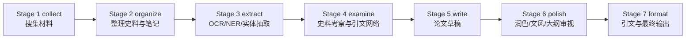

# 历史研究全流程工作流设计

> 当前版本: 2026-04-28
> 状态: 根目录索引版，详细设计已拆分到 `docs/workflow/`

## 设计目标

工作流服务于“日本史研究全流程工具箱”的原始构想: 从材料搜集、史料整理、OCR/NER、史料考察，到论文写作、润色和最终引文格式化，形成可复核、可恢复、可归档的研究流水线。

核心约束:

- 本地优先，外部 API 只作为可替换增强层。
- 所有阶段写回统一项目状态，而不是散落在临时脚本里。
- 每个阶段都保留 `backend/provider/model/confidence/needs_review` 等执行元数据。
- 本地小模型后端必须先通过短 smoke，再进入复杂 OCR/NER/摘要/写作任务。
- 阶段输出必须能被人工复核、断点恢复和后续模块复用。
- 日志与报告不记录真实密钥、敏感原文或可复原的私密材料。

## 分层文档

| 文档 | 用途 |
| --- | --- |
| [docs/workflow/README.md](docs/workflow/README.md) | 工作流总览与阅读路径 |
| [docs/workflow/STAGE_PROTOCOL.md](docs/workflow/STAGE_PROTOCOL.md) | 阶段输入输出、元数据、复核队列与 artifact 协议 |
| [docs/workflow/STAGE_1_3_INGEST_ANALYSIS.md](docs/workflow/STAGE_1_3_INGEST_ANALYSIS.md) | Stage 1-3: 材料搜集、整理、OCR/NER 抽取 |
| [docs/workflow/STAGE_4_7_WRITING_OUTPUT.md](docs/workflow/STAGE_4_7_WRITING_OUTPUT.md) | Stage 4-7: 史料考察、写作、润色、格式化 |
| [docs/workflow/PRIVACY_AND_ARTIFACTS.md](docs/workflow/PRIVACY_AND_ARTIFACTS.md) | 隐私、日志、中间文件、归档与清理规范 |
| [docs/project/AI_AGENT_SKILL_DESIGN_2026-04-25.md](docs/project/AI_AGENT_SKILL_DESIGN_2026-04-25.md) | AI agent 工作区 skill 设计方案 |
| [docs/project/AI_AGENT_SKILL_UPGRADE_DESIGN_2026-04-25.md](docs/project/AI_AGENT_SKILL_UPGRADE_DESIGN_2026-04-25.md) | AI agent skill 小模型友好升级方案 |

## 七阶段流水线

## 当前主实现

- 项目状态模型: `tools/workflow/research_project.py`
- 编排层: `tools/workflow/workflow_orchestrator.py`
- 阶段实现: `tools/workflow/stages/`
- Word 输出: `tools/workflow/word_exporter.py`
- 统一任务层: `modules/task_manager.py`, `modules/unified_task_executor.py`
- API 入口: `app/app.py`

## 后续优化纪律

1. 以 [docs/project/MODULE_OPTIMIZATION_DESIGN_2026-04-21.md](docs/project/MODULE_OPTIMIZATION_DESIGN_2026-04-21.md) 为推进锚点。
2. 若发现新的优化方向，先补写到锚点文件，再实现。
3. 每个优化步骤完成后，必须在 `log/feature_development/` 输出报告。
4. 临时脚本和中间文件只允许短期存在，报告生成后归档或删除。
5. 根目录只保留稳定入口文档、稳定运行脚本和必要配置，长文档拆入 `docs/`。
6. 后续 AI agent 可使用 `docs/agent_skills/historyresearch-workspace/` 对齐隐私、package、测试和报告流程。
7. 使用 Ollama 等本地小模型时，优先走 `local_llm` 后端并保留 fallback 链，例如 `local_llm -> script`。
8. Stage 2 学术笔记生成应优先记录 `academic_note` package 摘要，便于后续 vault、写作和复核链消费。
9. Stage 6 写作润色应优先记录 `paper_polish` package 摘要，低置信或 fallback 结果进入复核链。
10. Stage 6 反向大纲审校应优先记录 `outline_review` package 摘要，结构缺口和失衡标记进入复核链。
11. Stage 6 文风迁移应优先记录 `style_transfer` package 摘要，激进改写风险和 fallback 输出进入复核链。
12. Stage 2 Obsidian/vault 输出应优先记录 `obsidian_note_export` 与 `obsidian_graph` package 摘要，所有读写路径必须约束在托管 vault 内。
13. Stage 3/分析链路若使用历史发言提取，应优先记录 `historical_speech_analysis` package 摘要，承载 speeches/dates/entities 与复核标记。
14. 嵌入检索链路应优先记录 `embedding_index/semantic_search` package 摘要；未显式加载模型时必须使用轻量 fallback，避免自动触发重依赖或外网模型下载。
15. Stage 3 实体消歧应优先记录 `entity_disambiguation` package 摘要，承载规范名、类型变化、未知规则和低置信复核信号。
16. Stage 1/5 的领域探索和草稿生成应优先记录 `field_research/field_draft` package 摘要，逐步把 `FieldSearch/FieldSynthesis/FieldDrafting` 拆分到稳定外部契约后面。
17. Stage 7 引用格式化应优先记录 `citation_formatting` package 摘要，格式层只负责规范化 citation record 的渲染，不承担解析或校验职责。
18. 历史引文核验链路应优先通过 `historical_citation` 统一任务或 `HistoricalCitationWorkspaceInterface` 读取 `historical_citation_workspace_package`；默认 DOCX 解析保持离线，NDL/Japan Search/Internet Archive 检索和下载必须由调用方显式开启，旧 verifier 原始文件不得作为工作流集成点继续扩写。
19. 版面分析链路应优先读取 `layout_page/layout_document` package；小模型 agent 可先走 metadata-only 路径，只有明确需要 PDF/图像分析时才加载 `fitz/numpy/PIL/ONNX` 等重依赖。
20. 古典籍 OCR 训练准备链路应优先读取 `date_extraction/date_match_pairs/training_samples` package；默认离线，不读取本地密钥配置文件，LLM 日期识别必须由调用方显式开启。
21. 古典籍 OCR 训练总线应优先记录 `training_workflow_summary/training_samples` package；总线只协调版面分析、日期匹配和样本导出，不把实验性长流程结果作为唯一状态来源。
22. 人物传记结构化链路应优先读取 `biography_entities/biography_batch` package；默认只运行本地规则，OCR、LLM、skill 或 MCP 后端必须显式接入并回收到同一 schema。
23. `biographical_ner.py` 定位为人物传记专属离线规则库；后续应被 `BiographyExtractor` 或薄 pipeline 调用，不再作为并行主流程扩张。
24. `biography_pipeline.py` 定位为人物传记薄工作流封装；后续只协调 PDF/OCR 与 `biography_batch` package，不再维护独立实体 schema。
25. 统一任务层必须优先公开 `TaskManager.get_task_registry()`、`get_capabilities()` 与 `execute_task_package()`；API、skill、MCP 和小模型 agent 不应直接猜测 adapter 内部入口，而应消费任务注册表、preset、backend 与 `task_execution` envelope。
26. 底层 `UnifiedTaskExecutor` 执行结果必须携带 `validation/confidence/needs_review/quality_flags`；artifact 只在调用方显式传入路径时写出，且不得写入 `secrets/`。
27. `module_adapters` 只做薄代理和兼容层；新增调用方应先读取 `get_adapter_registry()` 或 `get_adapter_spec()`，再通过 adapter 的主方法或 `execute_package()` 调用。
28. 工作流项目状态应通过 `ResearchProject.register_package()` 或 `register_artifact()` 登记 package、artifact、quality flags 与 review queue，避免各阶段手写不一致的挂载逻辑。
29. `WorkflowOrchestrator` 负责 checkpoint 和异常摘要的统一登记；阶段失败必须产生 `workflow_stage_failure` package，而不是只把异常字符串写入 metadata。
30. Stage 3 的 NER 链路应保存 `task_layer_snapshot`，并优先通过统一任务层 `execute_task_package()` 获取 `task_execution` 摘要；旧执行方法只作为兼容 fallback。
31. 密钥与配置 facade 默认只能返回脱敏状态报告；key hash、真实 secrets 路径和任何密钥值不得进入 API、日志、报告或 agent 能力快照。
32. API 层健康检查和能力查询必须走 lazy service 状态，不得因为 `/api/system/status` 或 app factory 初始化而加载 OCR/LLM/下载器等重服务。
33. artifact manager 必须采用 managed-root 策略；默认只登记 manifest，显式写入时也必须拒绝 `secrets/` 与 root 外路径。
34. 优化分支归档先做 manifest 和引用状态确认；仍被测试、动态导入或兼容 facade 使用的 `optimized/enhanced/integrated` 文件不得直接移动。
35. Stage 2 的 academic note、Obsidian note export 和 graph package 必须通过 `ResearchProject.register_package()` 进入项目状态，vault/export artifact 通过 `register_artifact()` 登记。
36. Stage 4 的 citation network 与 outline review 必须同时保留 execution_summary 和项目级 package 登记，确保 citation/outline 复核项可从 review queue 追踪。
37. Stage 5 必须登记 `field_draft` 和/或 `paper_draft` package；source snapshot、草稿长度、结构、引用占位和质量标记要进入项目状态，供 Stage 6/7 消费。
38. Stage 6 必须将 `paper_polish`、`style_transfer`、`outline_review` package 通过 `ResearchProject.register_package()` 登记，并在 `package_protocol` 中保留 registered package 摘要，避免润色链只写 execution_summary 而无法被 Stage 7、API 或 agent skill 追踪。
39. Stage 7 必须通过 `ResearchProject.register_package()` 登记 `citation_formatting` package，并通过 `register_artifact()` 登记最终 Word 输出；`package_protocol` 与 `artifact_protocol` 是最终输出交接的审计入口。
40. Workflow checkpoint 写入必须经过 `ArtifactManager` 托管 root；`WorkflowOrchestrator` 可以继续把 checkpoint path 登记回 `ResearchProject`，但不应绕过 artifact manager 的路径约束直接写散落 JSON。
41. API 统一任务入口必须返回 `task_execution` envelope；`/api/tasks/execute` 不应只返回旧式 adapter result，否则前端、skill、MCP 和 agent 无法共享 `schema_version/task_options/quality_flags`。
42. `optimized/enhanced/integrated` 分支文件在仍有测试或动态导入引用时只允许 manifest/exit-prep 归档，不允许物理移动；物理移动必须先完成 canonical package/facade 覆盖和 rollback note。
43. AI agent skill 应先运行只读契约快照，读取 `TaskManager` 任务注册表和 `ArtifactManager` 能力摘要，再选择 API/task/workflow 路径；小模型不应凭模块文件名猜测调用入口。
44. tracked 配置文件只能保存公共模板、环境变量名和相对路径；`config/api_config.json`、`config/current_environment.json`、`config/external_config.json` 若再次出现本机绝对路径、真实 key/token、NDL 登录名或密码，`scripts/check_github_upload_safety.py` 必须重新阻断上传。
