# 工作流程图

## 文档信息

| 属性 | 内容 |
|------|------|
| 文档名称 | WORKFLOW_DIAGRAM.md |
| 版本 | 3.0.0 |
| 创建日期 | 2026-03-28 |
| 更新日期 | 2026-04-01 |
| 文档性质 | 核心技术参考文档 |
| 关联文档 | [COMPREHENSIVE_TECHNICAL_GUIDE.md](COMPREHENSIVE_TECHNICAL_GUIDE.md) |

## 概述

本文档以Mermaid流程图的形式，系统展示AItools-for-historyresearch工作区的所有核心业务流程。流程图覆盖文档处理、OCR识别、学术分析、NDL搜索等主要功能模块，为模块开发与测试工作提供规范化参考依据。

### 文档定位与使用说明

本文档作为系统架构的可视化参考，与技术指南（COMPREHENSIVE_TECHNICAL_GUIDE.md）互为补充：
- **本文档**：侧重于流程可视化，以图表形式展示模块间的调用关系与数据处理路径
- **技术指南**：侧重于实现细节，提供API接口、配置参数与代码示例

### 独立模块文档索引

以下模块已具备独立的技术文档，本工作流程图仅展示其核心调用流程，详细说明请参阅相应文档：

| 模块名称 | 独立文档路径 | 功能概述 |
|----------|-------------|----------|
| IntelligentResearchAssistant | [intelligent_research_assistant/README.md](intelligent_research_assistant/README.md) | 统一研究助手（整合原open_source_finder和learning_module） |
| NDL搜索模块 | [ndl-search/docs/README.md](ndl-search/docs/README.md) | 日本国立国会图书馆文献检索与下载 |

### 架构变更说明（v3.0.0）

**重要变更**：
- `open_source_finder` 和 `learning_module` 已整合为 `IntelligentResearchAssistant` 模块
- 原模块已归档至 `archive/archived_modules/` 目录
- 新模块提供统一接口，支持多平台搜索、深度分析和智能报告生成
- 详细迁移指南请参考 [迁移指南](intelligent_research_assistant/docs/MIGRATION_GUIDE.md)

---

## 第一部分：核心模块架构总览

### 1.1 系统整体架构

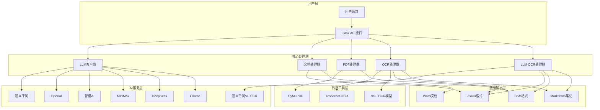

---

## 第二部分：文档处理流程

### 2.1 学术论文润色流程

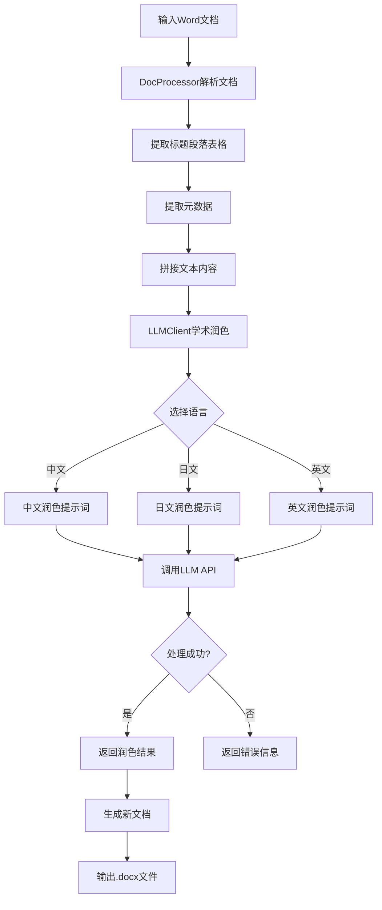

### 2.2 文档解析详细流程

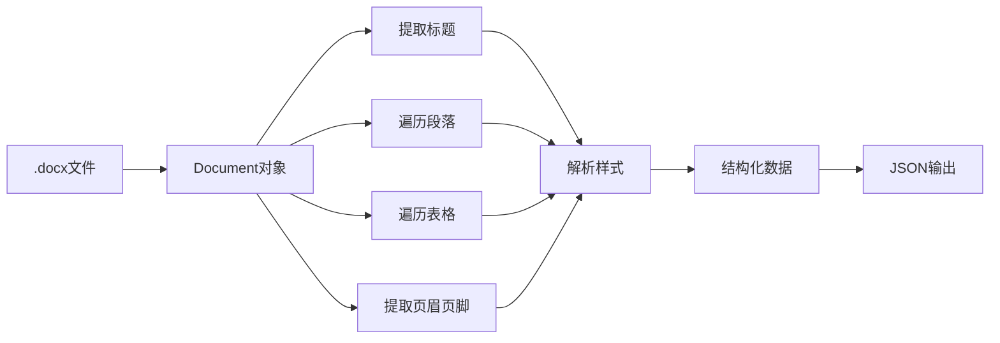

---

## 第三部分：PDF处理与OCR流程

### 3.1 PDF OCR完整处理流程

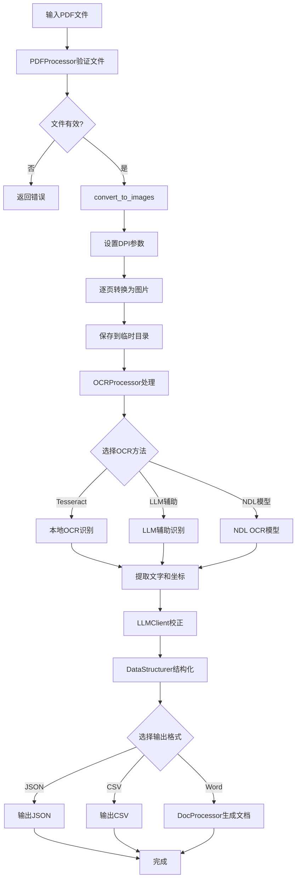

### 3.2 OCR引擎选择流程

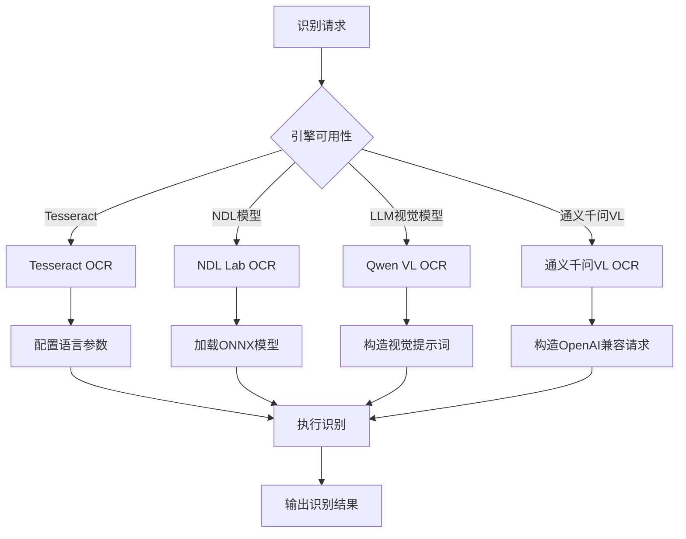

### 3.2.1 LLM OCR处理流程（通义千问VL OCR）

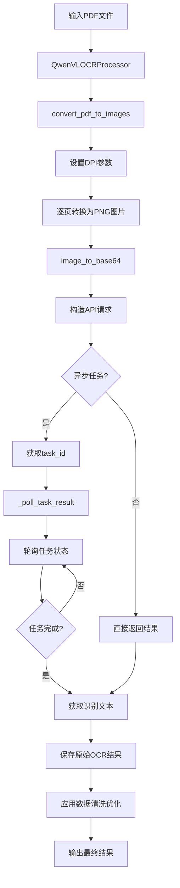

### 3.2.2 通义千问VL OCR API调用流程

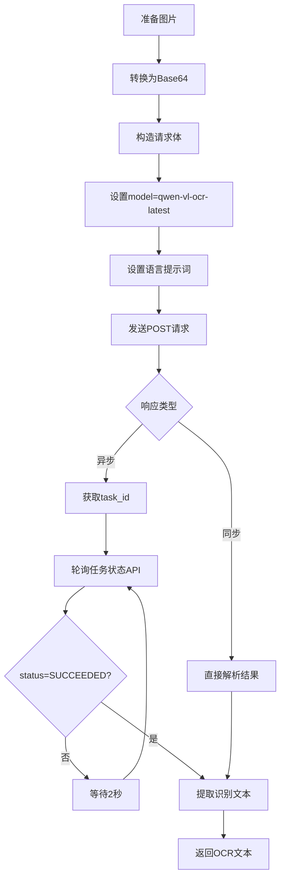

### 3.2.3 LLM OCR数据清洗流程

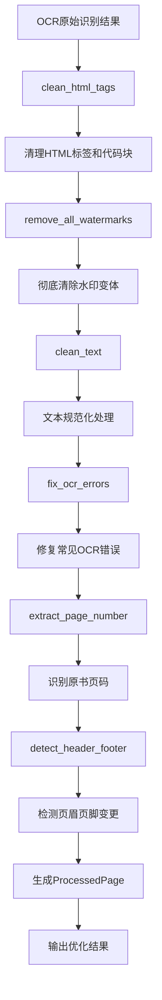

### 3.3 OCR结果优化处理流程

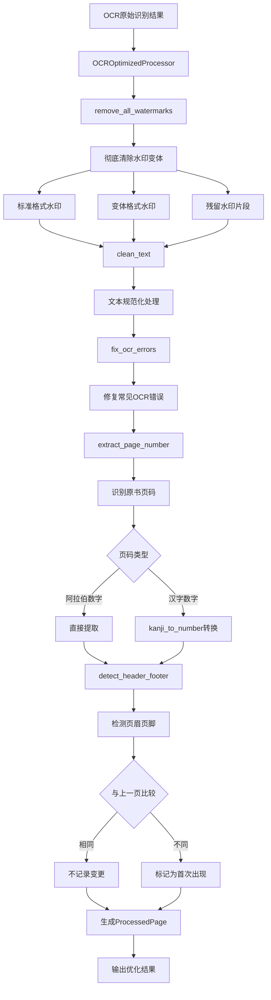

### 3.4 OCR水印去除详细流程

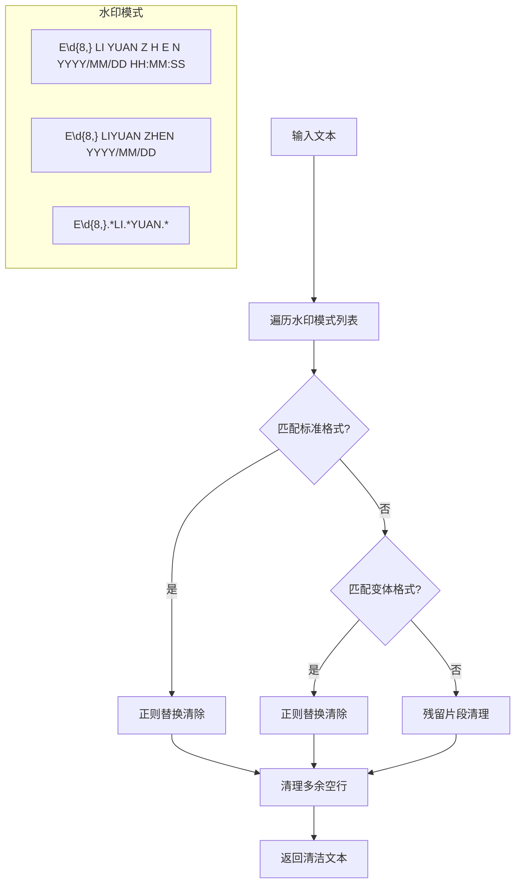

### 3.5 页码识别与转换流程

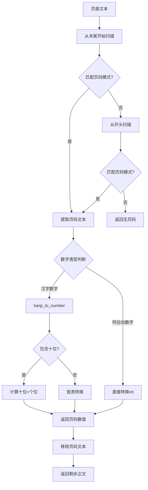

### 3.6 页眉页脚变更检测流程

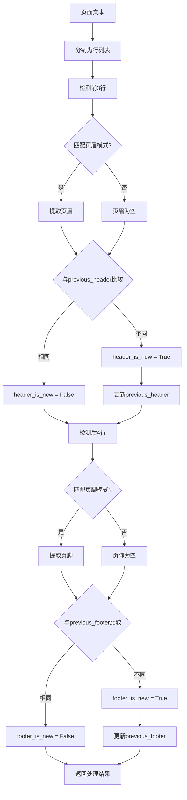

### 3.7 OCR优化结果输出流程

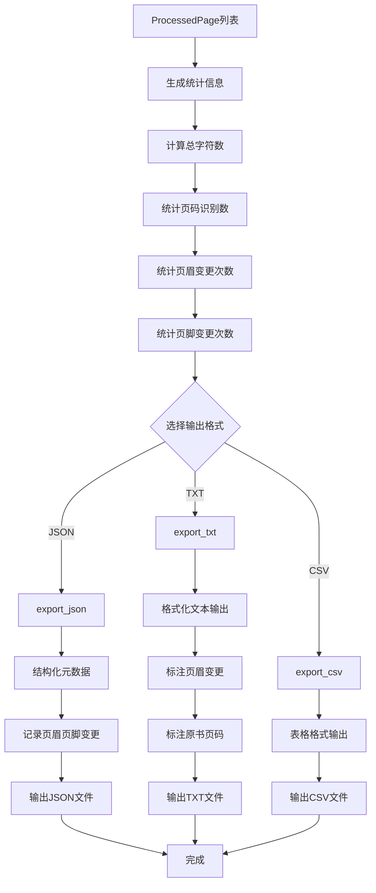

---

## 第四部分：学术笔记生成流程

### 4.1 Obsidian笔记生成流程

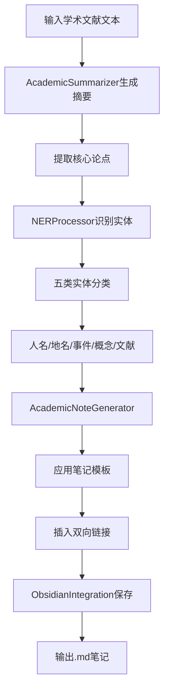

### 4.2 实体识别处理流程

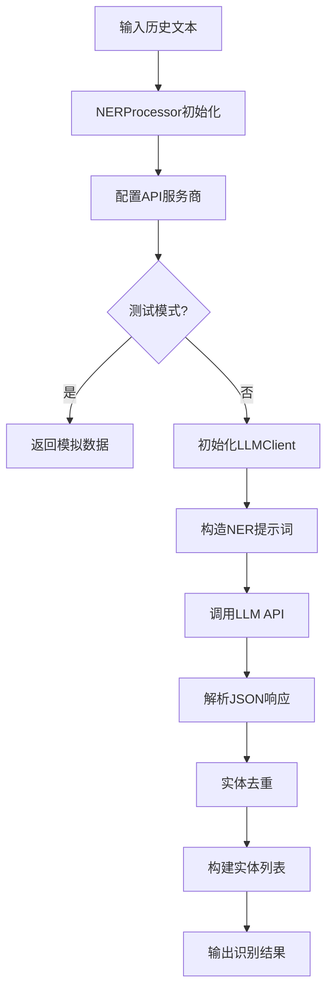

---

## 第五部分：论文润色精简流程

### 5.1 智能精简处理流程（修订模式方案）

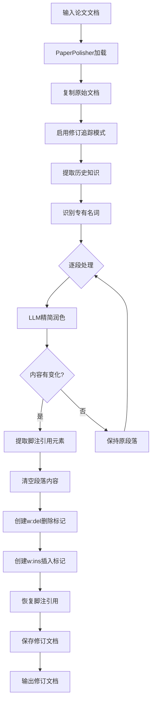

### 5.1.1 修订模式技术架构

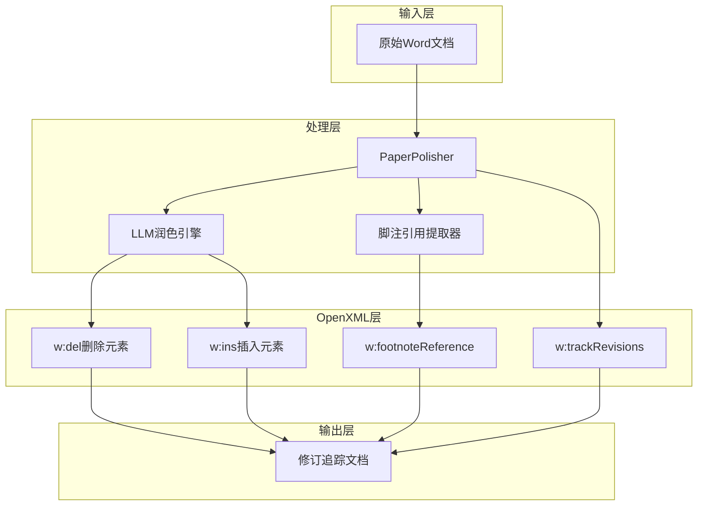

### 5.1.2 脚注引用保护机制

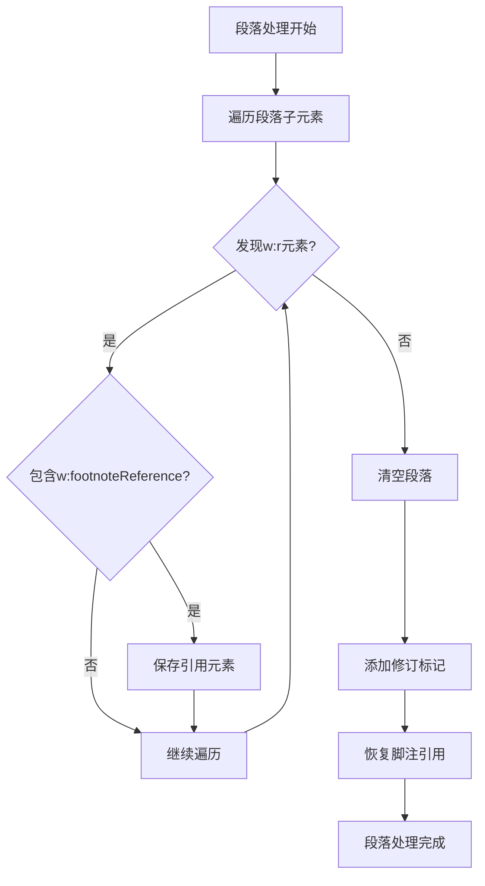

### 5.2 逆向大纲分析流程

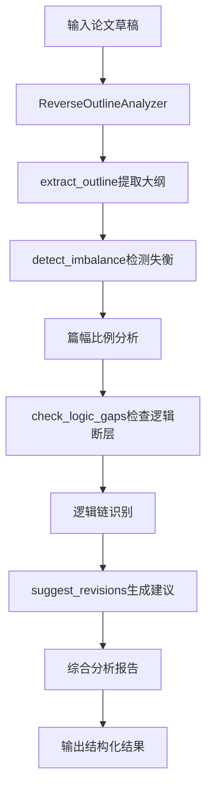

---

## 第六部分：引用规范化流程

### 6.1 引用格式转换流程

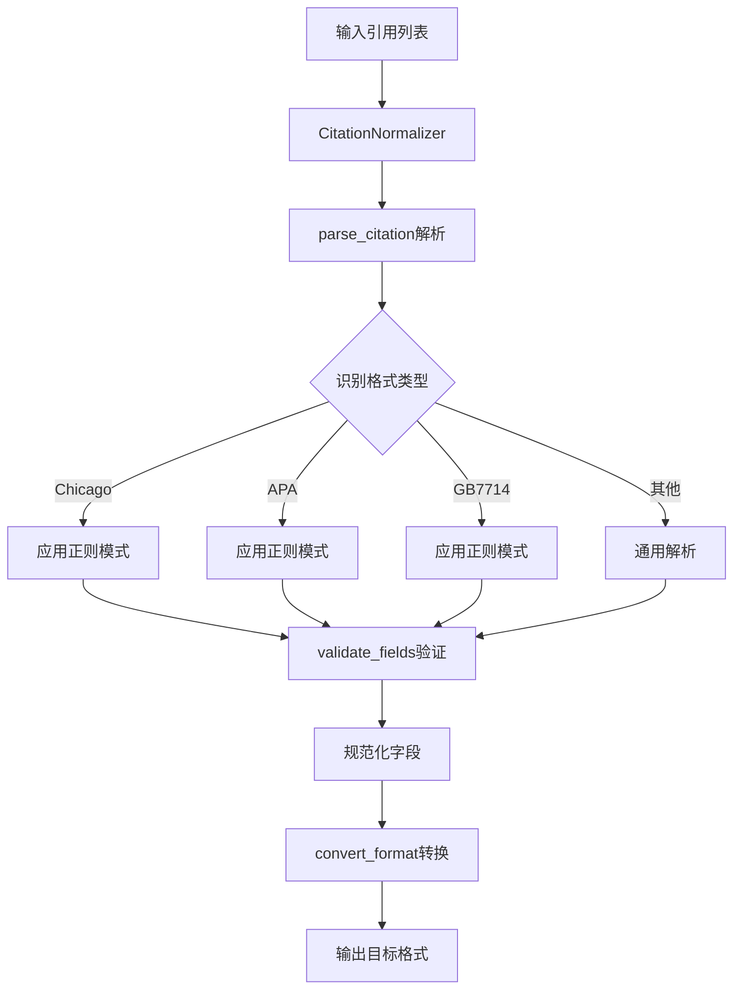

---

## 第6.5部分：新增模块流程

### 6.5.1 统一OCR处理流程

```mermaid
flowchart TD
    A[输入图片] --> B[UnifiedOCRProcessor]
    B --> C{选择OCR模型}
    C -->|近代现代文献| D[ndlocr_lite]
    C -->|古典籍文献| E[ndlkotenocr_lite]
    D --> F[加载ONNX模型]
    E --> F
    F --> G[版面分析]
    G --> H[文字识别]
    H --> I[后处理优化]
    I --> J[UnifiedOCRResult]
    J --> K[输出识别结果]
```

### 6.5.2 文风分析与迁移流程

```mermaid
flowchart TD
    A[输入文本] --> B[StyleTransfer]
    B --> C[analyze_style_matrix]
    C --> D[句法结构分析]
    C --> E[词汇深度分析]
    C --> F[语气叙事分析]
    C --> G[学术修辞分析]
    D --> H[文风矩阵]
    E --> H
    F --> H
    G --> H
    H --> I{迁移方式}
    I -->|矩阵迁移| J[transfer_style_with_matrix]
    I -->|少样本模仿| K[few_shot_style_transfer]
    J --> L[输出迁移文本]
    K --> L
```

### 6.5.3 虚拟人格对话流程

```mermaid
flowchart TD
    A[用户输入] --> B[VirtualPersonaChatbot]
    B --> C{选择人格}
    C -->|福泽谕吉| D[fukuzawa人格]
    C -->|丸山真男| E[maruyama人格]
    C -->|涩泽荣一| F[shibusawa人格]
    D --> G[_generate_persona_system_prompt]
    E --> G
    F --> G
    G --> H[构造角色提示词]
    H --> I{对话类型}
    I -->|学术咨询| J[consult]
    I -->|历史评论| K[comment_on_history]
    I -->|角色扮演| L[start_conversation]
    J --> M[调用LLM API]
    K --> M
    L --> M
    M --> N[输出人格化回复]
```

### 6.5.4 引文网络分析流程

```mermaid
flowchart TD
    A[输入文献集合] --> B[CitationNetworkAnalyzer]
    B --> C[extract_citations]
    C --> D[引用模式匹配]
    D --> E[解析引用关系]
    E --> F[build_citation_graph]
    F --> G[构建节点和边]
    G --> H[identify_academic_schools]
    H --> I[聚类分析]
    I --> J[trace_theory_evolution]
    J --> K[时间线构建]
    K --> L[输出网络图谱]
```

### 6.5.5 实体消歧流程

```mermaid
flowchart TD
    A[输入实体和上下文] --> B[EntityDisambiguator]
    B --> C[查找歧义实体]
    C --> D{实体在词典中?}
    D -->|否| E[返回原实体]
    D -->|是| F[获取候选含义]
    F --> G[上下文模式匹配]
    G --> H{匹配成功?}
    H -->|是| I[返回消歧结果]
    H -->|否| J[计算置信度]
    J --> K{置信度>阈值?}
    K -->|是| L[返回最佳匹配]
    K -->|否| M[返回多个候选]
```

### 6.5.6 嵌入模型管理流程

```mermaid
flowchart TD
    A[输入文档集合] --> B[EmbeddingManager]
    B --> C{选择嵌入模型}
    C -->|BGE-M3| D[bge-m3]
    C -->|Qwen3| E[qwen3-embedding]
    C -->|OpenAI| F[text-embedding-3]
    C -->|Ollama| G[ollama-local]
    D --> H[生成向量嵌入]
    E --> H
    F --> H
    G --> H
    H --> I[build_index]
    I --> J[构建向量索引]
    J --> K[支持语义检索]
```

### 6.5.7 论文润色增强流程

```mermaid
flowchart TD
    A[输入Word文档] --> B[PaperPolisherEnhanced]
    B --> C[提取正文和脚注]
    C --> D{选择润色策略}
    D -->|段落润色| E[ParagraphPolishingStrategy]
    D -->|逐句润色| F[SentencePolishingStrategy]
    D -->|修订模式| G[RevisionPolishingStrategy]
    E --> H[调用LLM润色]
    F --> H
    G --> H
    H --> I[脚注引用重建]
    I --> J[应用修订追踪]
    J --> K[生成润色文档]
```

### 6.5.8 史料发言识别与年代提取流程

```mermaid
flowchart TD
    A[OCR处理结果] --> B[HistoricalSpeechExtractor]
    B --> C{选择数据源格式}
    C -->|JSON| D[_load_json_result]
    C -->|CSV| E[_load_csv_result]
    C -->|TXT| F[_load_txt_result]
    D --> G[解析页面数据]
    E --> G
    F --> G
    G --> H[analyze_publication_date]
    H --> I[推断文献年代]
    I --> J[process_ocr_result]
    J --> K[逐页处理]
    K --> L[extract_speeches]
    L --> M[识别发言内容]
    M --> N[extract_dates]
    N --> O[提取年代信息]
    O --> P[extract_entities]
    P --> Q[NER实体识别]
    Q --> R[生成HistoricalSpeechRecord]
    R --> S{选择输出格式}
    S -->|JSON| T[export_json]
    S -->|CSV| U[export_csv]
    S -->|Markdown| V[export_markdown]
    T --> W[输出结果]
    U --> W
    V --> W
```

### 6.5.9 发言内容识别详细流程

```mermaid
flowchart TD
    A[输入文本] --> B[extract_speeches]
    B --> C[遍历发言模式列表]
    C --> D{匹配发言模式?}
    D -->|直接引语| E[匹配「」模式]
    D -->|引用文献| F[匹配『』模式]
    D -->|括号注释| G[匹配（）模式]
    D -->|古文陈述| H[匹配候文模式]
    E --> I[提取发言文本]
    F --> I
    G --> I
    H --> I
    I --> J[_extract_speaker]
    J --> K[从上下文提取发言者]
    K --> L[构建SpeechSegment]
    L --> M[返回发言列表]
```

### 6.5.10 年代信息提取详细流程

```mermaid
flowchart TD
    A[输入文本] --> B[extract_dates]
    B --> C[遍历日期模式列表]
    C --> D{匹配日期类型?}
    D -->|年号完整日期| E[明治十年一月四日]
    D -->|年号年份| F[明治十年]
    D -->|西历日期| G[1877年1月4日]
    D -->|月日| H[十二月二十六日]
    D -->|汉字月日| I[十二月二十六日]
    E --> J[_parse_date_match]
    F --> J
    G --> J
    H --> J
    I --> J
    J --> K[_era_to_western_year]
    K --> L[年号转西历]
    L --> M[_kanji_to_number]
    M --> N[汉字数字转换]
    N --> O[构建DateInfo]
    O --> P[返回年代列表]
```

### 6.5.11 出版年代推断流程

```mermaid
flowchart TD
    A[OCR数据] --> B[analyze_publication_date]
    B --> C[遍历所有页面]
    C --> D[提取所有日期]
    D --> E{有年份信息?}
    E -->|是| F[取最大年份]
    E -->|否| G[检查页眉]
    F --> H[推断出版年代]
    G --> I{页眉含年号?}
    I -->|是| J[提取年号]
    I -->|否| K[全文扫描年号]
    J --> H
    K --> L[正则匹配年号年份]
    L --> M[转换为西历]
    M --> H
    H --> N[生成出版信息]
    N --> O[返回推断结果]
```

---

## 第七部分：NDL搜索与下载流程

### 7.1 NDL文献检索流程

```mermaid
flowchart TD
    A[输入检索关键词] --> B[NDLSearcher.search]
    B --> C[构造查询参数]
    C --> D[访问NDL API]
    D --> E[获取搜索结果]
    E --> F[解析响应数据]
    F --> G[提取文献信息]
    G --> H[返回结果列表]
```

### 7.2 Selenium下载流程

```mermaid
flowchart TD
    A[获取PDF链接] --> B[SeleniumDownloader]
    B --> C[启动浏览器]
    C --> D[访问目标页面]
    D --> E[等待页面加载]
    E --> F[定位下载元素]
    F --> G[触发下载]
    G --> H[保存文件]
    H --> I[关闭浏览器]
    I --> J[返回文件路径]
```

### 7.3 NDL搜索模块完整架构

```mermaid
graph TB
    subgraph 用户接口层
        A[execute_ndl_search.py]
        B[命令行参数解析]
    end

    subgraph 配置管理层
        C[ConfigManager]
        D[NDLConfig]
        E[settings.py]
    end

    subgraph 核心处理层
        F[NDLSearcher]
        G[NDLAPIClient]
        H[SeleniumDownloader]
        I[SmartWait]
    end

    subgraph 工具层
        J[FileUtils]
        K[TextUtils]
        L[ValidationUtils]
        M[ReportUtils]
    end

    subgraph 数据层
        N[SearchResult]
        O[DownloadResult]
        P[ExecutionLog]
    end

    subgraph 外部服务
        Q[NDL SRU API]
        R[NDL OpenSearch]
        S[Chrome WebDriver]
    end

    A --> B
    B --> F
    C --> D
    D --> E
    F --> G
    F --> H
    F --> I
    G --> Q
    G --> R
    H --> S
    J --> F
    K --> F
    L --> F
    M --> F
    N --> F
    O --> F
    P --> F
```

### 7.4 NDL SRU API搜索流程

```mermaid
flowchart TD
    A[NDLAPIClient.search_sru] --> B[构造SRU查询]
    B --> C[设置operation=searchRetrieve]
    C --> D[设置recordSchema=dcndl]
    D --> E[设置query参数]
    E --> F[发送HTTP请求]
    F --> G{请求成功?}
    G -->|否| H[重试机制]
    H --> F
    G -->|是| I[解析XML响应]
    I --> J[提取numberOfRecords]
    J --> K[遍历rdf:RDF记录]
    K --> L[提取dcterms:title]
    L --> M[提取foaf:name]
    M --> N[提取NDL ID]
    N --> O[构建SearchResult列表]
    O --> P[返回结果和总数]
```

### 7.5 智能等待机制流程

```mermaid
flowchart TD
    A[SmartWait初始化] --> B[加载配置参数]
    B --> C{等待类型}
    C -->|条件等待| D[wait_for_condition]
    C -->|元素等待| E[wait_for_element]
    C -->|页面加载| F[wait_for_page_load]
    C -->|自适应等待| G[adaptive_wait]
    C -->|随机延迟| H[random_delay]
    
    D --> I[WebDriverWait.until]
    E --> I
    F --> I
    
    I --> J{条件满足?}
    J -->|是| K[返回True]
    J -->|否| L{超时?}
    L -->|是| M[返回False]
    L -->|否| I
    
    G --> N[计算等待时间]
    N --> O[time.sleep]
    O --> P[返回等待时间]
    
    H --> Q[随机延迟时间]
    Q --> R[避免检测]
    R --> P
```

### 7.6 PDF下载验证流程

```mermaid
flowchart TD
    A[下载完成] --> B[FileUtils.verify_pdf]
    B --> C{文件存在?}
    C -->|否| D[返回False]
    C -->|是| E{文件大小>0?}
    E -->|否| D
    E -->|是| F[读取文件头]
    F --> G{以%PDF-开头?}
    G -->|否| D
    G -->|是| H[读取文件尾]
    H --> I{包含%%EOF?}
    I -->|否| D
    I -->|是| J[计算MD5校验]
    J --> K[返回True]
```

### 7.7 NDL搜索执行脚本流程

```mermaid
flowchart TD
    A[execute_ndl_search.py] --> B[解析命令行参数]
    B --> C[加载配置]
    C --> D[初始化NDLSearcher]
    D --> E[search_and_download]
    E --> F{use_api?}
    F -->|是| G[NDLAPIClient.search_sru]
    F -->|否| H[浏览器搜索]
    G --> I[获取搜索结果]
    H --> I
    I --> J[遍历结果]
    J --> K[SeleniumDownloader.download]
    K --> L[验证PDF]
    L --> M{下载成功?}
    M -->|是| N[生成报告]
    M -->|否| O[记录错误]
    O --> P{还有结果?}
    P -->|是| J
    P -->|否| N
    N --> Q[输出执行摘要]
```

### 7.8 配置管理流程

```mermaid
flowchart TD
    A[ConfigManager] --> B{单例已创建?}
    B -->|是| C[返回现有实例]
    B -->|否| D[创建新实例]
    D --> E[初始化NDLConfig]
    E --> F[设置默认值]
    F --> G[配置元素定位器]
    G --> H[配置Chrome选项]
    H --> I[返回实例]
    
    C --> J{加载外部配置?}
    J -->|是| K[load_from_file]
    J -->|否| L[使用默认配置]
    K --> M[解析JSON/YAML]
    M --> N[更新配置项]
    N --> L
```

### 7.9 重试机制流程

```mermaid
flowchart TD
    A[retry_on_exception装饰器] --> B[执行函数]
    B --> C{发生异常?}
    C -->|否| D[返回结果]
    C -->|是| E{重试次数<最大值?}
    E -->|否| F[抛出异常]
    E -->|是| G[等待delay时间]
    G --> H[delay *= backoff]
    H --> B
```

### 7.10 进度显示流程

```mermaid
flowchart TD
    A[ProgressDisplay] --> B[start开始]
    B --> C[记录开始时间]
    C --> D[设置总数]
    D --> E[输出开始消息]
    E --> F[执行操作]
    F --> G[update更新]
    G --> H[计算耗时]
    H --> I[输出进度]
    I --> J{操作完成?}
    J -->|否| F
    J -->|是| K[complete完成]
    K --> L[输出总耗时]
```

### 7.11 NDL搜索与主系统集成流程

```mermaid
graph LR
    subgraph 主系统
        A[modules/]
        B[config/]
        C[data/]
    end

    subgraph NDL搜索模块
        D[ndl-search/]
        E[core/dl_searcher.py]
        F[config/settings.py]
        G[utils/helpers.py]
        H[tests/test_searcher.py]
    end

    subgraph 执行脚本
        I[execute_ndl_search.py]
        J[search_ethics_new_theory.py]
        K[download_ndl_final.py]
    end

    A --> E
    B --> F
    C --> D
    
    I --> E
    J --> E
    K --> E

    style D fill:#9cf,stroke:#333,stroke-width:2px
    style E fill:#f96,stroke:#333,stroke-width:2px
```

---

## 第八部分：配置与环境管理流程

### 8.1 LLM客户端初始化流程

```mermaid
flowchart TD
    A[创建LLMClient] --> B[加载配置字典]
    B --> C[获取provider类型]
    C --> D{provider类型}
    D -->|openai| E[初始化OpenAI客户端]
    D -->|dashscope| F[初始化通义千问]
    D -->|zhipu| G[初始化智谱AI]
    D -->|minimax| H[初始化MiniMax]
    D -->|ollama| I[初始化Ollama]
    D -->|deepseek| J[初始化DeepSeek]
    E --> K[配置API密钥]
    F --> K
    G --> K
    H --> K
    I --> K
    J --> K
    K --> L[设置base_url]
    L --> M[初始化完成]
```

### 8.2 环境检查流程

```mermaid
flowchart TD
    A[运行environment_checker] --> B[检查Python版本]
    B --> C{版本符合?}
    C -->|否| D[输出警告]
    C -->|是| E[检查核心依赖]
    E --> F{依赖完整?}
    F -->|否| G[输出缺失列表]
    F -->|是| H[检查NDL OCR]
    H --> I{NDL可用?}
    I -->|否| J[输出安装指南]
    I -->|是| K[检查配置文件]
    K --> L[生成检查报告]
    D --> M[结束]
    G --> M
    J --> M
    L --> M
```

---

## 第九部分：日志管理流程

### 9.1 功能开发日志流程

```mermaid
flowchart TD
    A[开始开发任务] --> B[create_feature_log]
    B --> C[记录任务信息]
    C --> D[创建任务清单]
    D --> E[记录技术方案]
    E --> F[执行开发]
    F --> G{遇到问题?}
    G -->|是| H[记录问题分析]
    H --> I[记录解决方案]
    I --> J[更新任务状态]
    J --> F
    G -->|否| K{任务完成?}
    K -->|否| F
    K -->|是| L[complete_log]
    L --> M[生成完成报告]
```

### 9.2 日志同步流程

```mermaid
flowchart LR
    A[创建日志] --> B[写入分类目录]
    B --> C[同步到根目录]
    C --> D[LATEST_WORK_LOG.md]
    D --> E[自动更新]
```

---

## 第十部分：错误处理与重试流程

### 10.1 API调用重试流程

```mermaid
flowchart TD
    A[发起API请求] --> B{请求成功?}
    B -->|是| C[返回结果]
    B -->|否| D{重试次数<最大值?}
    D -->|否| E[返回错误]
    D -->|是| F[等待重试延迟]
    F --> G[重试请求]
    G --> B
```

### 10.2 异常处理流程

```mermaid
flowchart TD
    A[执行操作] --> B{发生异常?}
    B -->|否| C[正常返回]
    B -->|是| D{异常类型}
    D -->|配置错误| E[提示检查配置]
    D -->|网络错误| F[提示检查网络]
    D -->|API错误| G[记录错误日志]
    D -->|其他| H[通用错误处理]
    E --> I[返回友好提示]
    F --> I
    G --> J[返回详细错误]
    H --> I
```

---

## 第十一部分：学习模块流程

> **详细文档**：[learning_module/README.md](learning_module/README.md)

本部分展示LearningModule的核心调用流程，详细API说明请参阅独立文档。

### 11.1 学习模块综合分析流程

```mermaid
flowchart TD
    A[输入模块名称和上下文] --> B[LearningModule初始化]
    B --> C[ResearchAnalyzer检索]
    C --> D[学术资源检索]
    D --> E[提取摘要和关键发现]
    E --> F[LiteratureAnalyzer分析]
    F --> G[文献核心内容分析]
    G --> H[提取技术要点]
    H --> I[ImprovementGenerator生成]
    I --> J[生成改进建议]
    J --> K[短期/中期/长期分类]
    K --> L[输出综合分析结果]
```

### 11.2 学习模块调用关系图

```mermaid
graph LR
    A[用户请求] --> B[LearningModule]
    B --> C[ResearchAnalyzer]
    B --> D[LiteratureAnalyzer]
    B --> E[ImprovementGenerator]
    
    C --> F[LLM API]
    D --> F
    E --> F
    
    C --> G[检索结果]
    D --> H[分析结果]
    E --> I[改进建议]
    
    G --> J[整合输入]
    H --> J
    J --> E
```

### 11.7 学习模块与NER模块集成流程

```mermaid
flowchart TD
    A[NER模块优化需求] --> B[LearningModule.analyze_and_suggest]
    B --> C[ResearchAnalyzer检索NER研究]
    C --> D[Japanese Historical NER检索]
    C --> E[Deep Learning NER检索]
    D --> F[合并检索结果]
    E --> F
    F --> G[LiteratureAnalyzer分析]
    G --> H[NER技术要点提取]
    H --> I[ImprovementGenerator生成建议]
    I --> J[NER特定优化建议]
    J --> K[短期改进建议]
    J --> L[中期改进建议]
    J --> M[长期改进建议]
    K --> N[应用改进到NER模块]
    L --> N
    M --> N
    N --> O[验证优化效果]
    O --> P[反馈迭代]
    P --> B
```

### 11.8 学习模块在系统架构中的位置

```mermaid
graph TB
    subgraph 用户层
        A[用户请求]
    end
    
    subgraph 功能模块层
        B[NER模块]
        C[PaperPolisher模块]
        D[CitationNormalizer模块]
        E[其他模块]
    end
    
    subgraph 学习优化层
        F[LearningModule]
        G[ResearchAnalyzer]
        H[LiteratureAnalyzer]
        I[ImprovementGenerator]
    end
    
    subgraph AI服务层
        J[LLM API]
    end
    
    A --> B
    A --> C
    A --> D
    A --> E
    
    B --> F
    C --> F
    D --> F
    E --> F
    
    F --> G
    F --> H
    F --> I
    
    G --> J
    H --> J
    I --> J
    
    style F fill:#f9f,stroke:#333,stroke-width:2px
    style G fill:#bbf,stroke:#333,stroke-width:1px
    style H fill:#bbf,stroke:#333,stroke-width:1px
    style I fill:#bbf,stroke:#333,stroke-width:1px
```

---

## 第十二部分：OpenSourceFinder 开源模块搜索与优化流程

> **详细文档**：[open_source_finder/README.md](open_source_finder/README.md)

本部分展示OpenSourceFinder的核心调用流程，详细API说明请参阅独立文档。

### 12.1 开源模块搜索完整工作流

```mermaid
flowchart TD
    A[输入模块名称和上下文] --> B[OpenSourceFinder初始化]
    B --> C[generate_keywords生成关键词]
    C --> D[search_all全平台搜索]
    D --> E[search_github搜索仓库]
    D --> F[search_huggingface搜索模型]
    E --> G[fetch_readme获取README]
    F --> H[获取模型信息]
    G --> I[计算评分]
    H --> I
    I --> J[rank_and_filter排序过滤]
    J --> K[generate_integration_report]
    K --> L[LLM分析推荐]
    L --> M[IntegrationReport整合报告]
    M --> N[execute_optimization执行优化]
    N --> O[保存结果和报告]
```

### 12.2 OpenSourceFinder 在系统架构中的位置

```mermaid
graph TB
    subgraph 用户层
        A[用户优化请求]
    end

    subgraph 功能模块层
        B[OCR模块]
        C[NER模块]
        D[PDF处理器]
        E[其他模块]
    end

    subgraph 学习优化层
        F[LearningModule]
        G[OpenSourceFinder]
    end

    subgraph 外部资源层
        K[GitHub API]
        L[HuggingFace API]
    end

    subgraph AI服务层
        M[LLM API]
    end

    A --> B
    A --> C
    A --> D
    A --> E

    F --> G
    G --> K
    G --> L
    G --> M

    style G fill:#f96,stroke:#333,stroke-width:2px
    style F fill:#f9f,stroke:#333,stroke-width:2px
```

---

## 附录：流程索引

| 流程编号 | 流程名称 | 所属模块 | 优先级 |
|----------|----------|----------|--------|
| 2.1 | 学术论文润色流程 | paper_polisher | 高 |
| 2.2 | 文档解析流程 | doc_processor | 高 |
| 3.1 | PDF OCR完整处理 | pdf_processor/ocr_processor | 高 |
| 3.2 | OCR引擎选择 | ocr_processor | 高 |
| 3.2.1 | LLM OCR处理流程 | llm_ocr_processor | 高 |
| 3.2.2 | 通义千问VL OCR API调用 | llm_ocr_processor | 高 |
| 3.3 | OCR结果优化处理 | ocr_optimized_processor | 高 |
| 3.4 | OCR水印去除 | ocr_optimized_processor | 高 |
| 3.5 | 页码识别与转换 | ocr_optimized_processor | 高 |
| 3.6 | 页眉页脚变更检测 | ocr_optimized_processor | 高 |
| 3.7 | OCR优化结果输出 | ocr_optimized_processor | 高 |
| 4.1 | Obsidian笔记生成 | academic_note_generator | 高 |
| 4.2 | 实体识别处理 | ner_processor | 高 |
| 5.1 | 智能精简处理 | paper_polisher | 中 |
| 5.2 | 逆向大纲分析 | reverse_outline_analyzer | 中 |
| 6.1 | 引用格式转换 | citation_normalizer | 中 |
| 6.5.1 | 统一OCR处理流程 | unified_ocr_processor | 高 |
| 6.5.2 | 文风分析与迁移流程 | style_transfer | 中 |
| 6.5.3 | 虚拟人格对话流程 | virtual_persona_chatbot | 中 |
| 6.5.4 | 引文网络分析流程 | citation_network_analyzer | 中 |
| 6.5.5 | 实体消歧流程 | ner_disambiguation | 高 |
| 6.5.6 | 嵌入模型管理流程 | embedding_manager | 中 |
| 6.5.7 | 论文润色增强流程 | paper_polisher_enhanced | 高 |
| 7.1 | NDL文献检索 | ndl-search | 中 |
| 7.2 | Selenium下载 | ndl-search | 中 |
| 7.3 | NDL搜索模块架构 | ndl-search | 高 |
| 7.4 | NDL SRU API搜索 | ndl-search | 高 |
| 7.5 | 智能等待机制 | ndl-search | 高 |
| 7.6 | PDF下载验证 | ndl-search | 高 |
| 7.7 | NDL搜索执行脚本 | ndl-search | 中 |
| 7.8 | 配置管理 | ndl-search | 中 |
| 7.9 | 重试机制 | ndl-search | 中 |
| 7.10 | 进度显示 | ndl-search | 低 |
| 7.11 | NDL与主系统集成 | ndl-search | 中 |
| 8.1 | LLM客户端初始化 | llm_client | 高 |
| 8.2 | 环境检查 | environment_checker | 高 |
| 9.1 | 功能开发日志 | workflow_logger | 中 |
| 9.2 | 日志同步 | workflow_logger | 中 |
| 10.1 | API调用重试 | llm_client | 高 |
| 10.2 | 异常处理 | 全局 | 高 |
| 11.1 | 学习模块综合分析 | learning_module | 高 |
| 11.2 | 学术资源检索 | learning_module | 高 |
| 11.3 | 文献分析 | learning_module | 中 |
| 11.4 | 改进建议生成 | learning_module | 中 |
| 12.1 | 开源模块搜索完整流程 | open_source_finder | 高 |
| 12.2 | GitHub仓库搜索 | open_source_finder | 高 |
| 12.3 | HuggingFace模型搜索 | open_source_finder | 高 |
| 12.4 | 仓库评分算法 | open_source_finder | 中 |
| 12.5 | 模型评分算法 | open_source_finder | 中 |
| 12.6 | 优化整合报告生成 | open_source_finder | 高 |
| 12.7 | 自动优化执行 | open_source_finder | 高 |
| 13.1 | 外部资料学习统一工作流 | 外部学习流程 | 高 |
| 13.2 | 提示词检测流程 | 外部学习流程 | 高 |
| 13.3 | LearningModule调用流程 | learning_module | 高 |
| 13.4 | OpenSourceFinder调用流程 | open_source_finder | 高 |
| 13.5 | 双模块并行调用流程 | 外部学习流程 | 高 |
| 13.6 | 知识整合流程 | 外部学习流程 | 高 |
| 13.7 | 模块更新流程集成 | 外部学习流程 | 高 |
| 13.8 | 模块优化流程集成 | 外部学习流程 | 高 |
| 13.9 | 研究计划制定集成 | 外部学习流程 | 高 |
| 13.10 | 信息整合路径 | 外部学习流程 | 高 |
| 13.11 | 触发条件与执行顺序 | 外部学习流程 | 高 |
| 13.12 | 完整工作流示例 | 外部学习流程 | 高 |
| 19.1 | 项目归档与清理工作流 | 项目维护 | 高 |
| 19.2 | 文件分类决策 | 项目维护 | 高 |
| 19.3 | 归档执行流程 | 项目维护 | 高 |
| 19.4 | 项目清理验证 | 项目维护 | 高 |
| 19.5 | 归档恢复流程 | 项目维护 | 中 |
| 20.1 | RAG模块完整工作流 | rag_module | 高 |
| 20.2 | RAG引擎初始化流程 | rag_module | 高 |
| 20.3 | 文档加载与处理流程 | rag_module | 高 |
| 20.4 | 文本分块处理流程 | rag_module | 高 |
| 20.5 | 向量存储流程 | rag_module | 高 |
| 20.6 | 检索流程 | rag_module | 高 |
| 20.7 | RAG模块系统架构 | rag_module | 高 |
| 20.8 | RAG与历史研究集成 | rag_module | 高 |

---

## 第十三部分：外部资料学习统一流程

### 13.1 概述

本部分定义了在进行"更新模块"、"优化模块"或"制定研究计划"时，如何自动检测并调用 LearningModule 和 OpenSourceFinder 进行外部资料学习的统一流程。

**触发条件**：
- 用户请求更新现有模块
- 用户请求优化特定功能
- 用户请求制定研究计划
- 用户明确要求"寻找外部资料进行学习"

### 13.2 统一检测与调用流程

```mermaid
flowchart TD
    A[开始：更新/优化/研究计划] --> B{检测外部学习需求}
    B --> C{需要外部学习?}
    C -->|是| D[准备学习上下文]
    C -->|否| Z[继续原流程]
    D --> E[选择学习模块]
    E --> F{LearningModule?}
    F -->|是| G[调用LearningModule]
    F -->|否| H{LearningModule + OpenSourceFinder?}
    H -->|是| I[并行调用两个模块]
    H -->|否| J[仅OpenSourceFinder]
    G --> K[学术资源检索]
    I --> K
    I --> L[开源项目搜索]
    J --> L
    K --> M[文献分析与要点提取]
    L --> N[仓库/模型评估排序]
    M --> O[生成改进建议]
    N --> P[生成整合报告]
    O --> Q[整合学习成果]
    P --> Q
    Q --> R[更新研究计划]
    R --> S[输出优化建议]
    S --> Z

    style G fill:#9f9,stroke:#333,stroke-width:2px
    style L fill:#f99,stroke:#333,stroke-width:2px
    style I fill:#ff9,stroke:#333,stroke-width:2px
```

### 13.3 触发条件矩阵

| 场景 | 触发关键词 | 触发模块 | 优先级 |
|------|-----------|----------|--------|
| 学术研究 | 研究、学术、文献、论文 | LearningModule | 1 |
| 技术调研 | 调研、分析、调查 | LearningModule | 1 |
| 模块优化 | 优化、改进、增强 | OpenSourceFinder | 2 |
| 功能升级 | 升级、更新、改进 | OpenSourceFinder | 2 |
| 全面学习 | 学习、外部资料、搜索 | 两个都调用 | 3 |
| 整合需求 | 整合、融合、结合 | 两个都调用 | 3 |

### 13.4 最佳实践

| 使用场景 | 推荐模块 | 说明 |
|----------|----------|------|
| 获取最新学术研究成果 | LearningModule | 深入理解技术原理，生成基于文献的改进建议 |
| 搜索开源解决方案 | OpenSourceFinder | 评估现有项目，找到可整合的预训练模型 |
| 全面了解技术领域 | 两者都使用 | 结合学术研究和开源项目，制定完整升级方案 |

---

## 第十四部分：模块优化工作流程

### 14.1 模块优化状态总览

| 序号 | 模块名称 | 文件名 | 优化状态 | 优先级 | 阶段 |
|------|---------|--------|----------|--------|------|
| 1 | 引用规范化模块 | citation_normalizer.py | ✅ 已完成第一阶段 | 高 | 阶段一 |
| 2 | 命名实体识别模块 | ner_processor.py | ⚠️ 待优化 | 高 | 阶段一 |
| 3 | 论文润色模块 | paper_polisher.py | ⚠️ 待优化 | 高 | 阶段一 |
| 4 | 逆向大纲分析模块 | reverse_outline_analyzer.py | ⚠️ 待优化 | 中 | 阶段二 |
| 5 | 学术笔记生成模块 | academic_note_generator.py | ⚠️ 待优化 | 中 | 阶段二 |
| 6 | 学术摘要生成模块 | academic_summarizer.py | ⚠️ 待优化 | 中 | 阶段二 |
| 7 | OCR处理模块 | ocr_processor.py | ⚠️ 待优化 | 高 | 阶段一 |
| 8 | PDF处理模块 | pdf_processor.py | ⚠️ 待优化 | 低 | 阶段三 |
| 9 | Word文档处理模块 | doc_processor.py | ⚠️ 待优化 | 低 | 阶段三 |
| 10 | LLM客户端模块 | llm_client.py | ⚠️ 待优化 | 中 | 阶段二 |

### 14.2 模块优化标准流程

```mermaid
flowchart TD
    A[开始模块优化] --> B[分析模块现状]
    B --> C[识别待优化项]
    C --> D[制定优化计划]
    D --> E[调用LearningModule]
    E --> F[学术资源检索]
    F --> G[调用OpenSourceFinder]
    G --> H[开源项目搜索]
    H --> I[生成综合性报告]
    I --> J[生成优化计划文档]
    J --> K{优化阶段}
    K -->|短期| L[1-2周实施]
    K -->|中期| M[1个月实施]
    K -->|长期| N[2-3个月实施]
    L --> O[实施优化代码]
    M --> O
    N --> O
    O --> P[编写单元测试]
    P --> Q[更新文档]
    Q --> R[验证优化效果]
    R --> S{效果达标?}
    S -->|是| T[生成优化报告]
    S -->|否| U[迭代优化]
    U --> O
    T --> V[更新WORKFLOW_DIAGRAM]
    V --> Z[优化完成]

    style E fill:#9f9,stroke:#333,stroke-width:2px
    style G fill:#f99,stroke:#333,stroke-width:2px
    style T fill:#9f9,stroke:#333,stroke-width:2px
```

### 14.3 优化计划文档结构

每个模块的优化计划应包含以下内容：

1. **模块概述**
   - 模块功能描述
   - 在系统中的位置
   - 核心价值

2. **现状分析**
   - 现有功能列表
   - 已实现特性
   - 待解决问题

3. **外部资料搜集**
   - LearningModule检索结果
   - OpenSourceFinder搜索结果
   - 学术资源链接
   - 开源项目链接

4. **优化建议**
   - 短期改进（1-2周）
   - 中期改进（1个月）
   - 长期改进（2-3个月）

5. **实施步骤**
   - 具体任务列表
   - 时间安排
   - 责任人

6. **预期效果**
   - 性能指标提升
   - 功能改进
   - 用户体验优化

7. **参考资料**
   - 学术论文（带链接）
   - 开源项目（带链接）
   - HuggingFace模型（带链接）
   - 外部工具网站（带链接）

### 14.4 引用资源标注规范

**学术论文引用格式**：

```markdown
**论文标题**
- 来源: [期刊/会议名称]
- 链接: [URL]
- 发表时间: [年份]
- 用途: [具体应用场景]
```

**开源项目引用格式**：

```markdown
**项目名称**
- 来源: GitHub
- 链接: [URL]
- 评分: ⭐ [stars数量]
- 下载量: [下载次数]
- 用途: [具体应用场景]
```

**HuggingFace模型引用格式**：

```markdown
**模型名称**
- 来源: HuggingFace Hub
- 链接: [URL]
- 下载量: [下载次数]
- 用途: [具体应用场景]
```

**外部工具引用格式**：

```markdown
**工具名称**
- 来源: [官方网站]
- 链接: [URL]
- 用途: [具体应用场景]
```

### 14.5 优化工作流程集成

将模块优化工作流程集成到WORKFLOW_DIAGRAM.md的流程索引中：

| 流程编号 | 流程名称 | 所属模块 | 优先级 |
|----------|----------|----------|--------|
| 14.1 | 模块优化标准流程 | 全局 | 高 |
| 14.2 | 优化计划文档生成 | 全局 | 中 |
| 14.3 | 引用资源标注 | 全局 | 高 |

---

## 第十五部分：参考资料管理

### 15.1 参考资料分类

**学术资源**：

| 类型 | 说明 | 示例 |
|------|------|------|
| 学术论文 | 学术会议和期刊论文 | arXiv, ACL Anthology |
| 技术文档 | 官方技术文档 | CrossRef API, DOI Foundation |
| 学术数据库 | 学术文献数据库 | ACM DL, IEEE Xplore |

**开源资源**：

| 类型 | 说明 | 示例 |
|------|------|------|
| GitHub项目 | 开源代码仓库 | transformers, spaCy |
| HuggingFace模型 | 预训练模型库 | bert-base-japanese |
| 开源工具 | 开源软件工具 | Tesseract OCR, EasyOCR |

**外部服务**：

| 类型 | 说明 | 示例 |
|------|------|------|
| API服务 | 外部API接口 | CrossRef API, GitHub API |
| 在线工具 | 在线Web服务 | Zotero, Obsidian |

### 15.2 参考资料维护

**更新机制**：

1. 每次模块优化时更新相关参考资料
2. 定期审查链接有效性
3. 添加新的优质资源
4. 移除失效链接

**质量标准**：

1. 优先选择官方和权威来源
2. 选择活跃维护的项目
3. 优先选择有详细文档的资源
4. 评估资源的适用性和可靠性

### 15.3 参考资料文档

详细的参考资料清单请参阅：

- [MODULE_OPTIMIZATION_PLAN.md](file:///c:/Users/lyzha/Desktop/AItools-for-historyresearch/MODULE_OPTIMIZATION_PLAN.md) - 模块优化计划总览

该文档包含：

- 所有模块的优化计划
- 完整的学术论文引用列表
- 详细的GitHub开源项目链接
- HuggingFace模型资源
- 外部工具和网站链接

---

## 第十六部分：优化版模块流程图

### 16.1 NER处理器优化版流程

```mermaid
flowchart TD
    A[输入历史文本] --> B[NERProcessorOptimized]
    B --> C{use_dictionary?}
    C -->|是| D[_dictionary_match词典匹配]
    C -->|否| E[跳过词典匹配]
    D --> F[合并词典实体]
    E --> F
    F --> G{test_mode?}
    G -->|是| H[_recognize_mock_entities]
    G -->|否| I[_recognize_with_llm]
    H --> J[合并LLM实体]
    I --> J
    J --> K[_post_process_entities后处理]
    K --> L[实体去重]
    L --> M[置信度评分]
    M --> N[输出实体列表]
```

### 16.2 OCR处理器优化版流程

```mermaid
flowchart TD
    A[输入图片] --> B[OCRProcessorOptimized]
    B --> C{enable_preprocessing?}
    C -->|是| D[ImagePreprocessor]
    D --> E[倾斜校正]
    E --> F[降噪处理]
    F --> G[对比度增强]
    G --> H[锐度增强]
    H --> I[二值化处理]
    C -->|否| J[跳过预处理]
    I --> K{选择OCR引擎}
    J --> K
    K -->|Tesseract| L[extract_text_from_image]
    K -->|NDL| M[ndl_ocr]
    K -->|NDL-Lite| N[ndlocr_lite_ocr]
    K -->|LLM| O[llm_ocr]
    K -->|多引擎对比| P[compare_engines]
    L --> Q[OCRResult]
    M --> Q
    N --> Q
    O --> Q
    P --> R[get_best_result]
    R --> Q
    Q --> S[输出识别结果]
```

### 16.3 论文润色优化版流程

```mermaid
flowchart TD
    A[输入Word文档] --> B[PaperPolisherOptimized]
    B --> C[_load_history_knowledge]
    C --> D[提取历史术语]
    D --> E[加载领域术语库]
    E --> F[遍历段落]
    F --> G[polish_paragraph]
    G --> H{段落长度检查}
    H -->|过短| I[保持原样]
    H -->|正常| J[提取保护术语]
    J --> K[构造润色提示词]
    K --> L[调用LLM润色]
    L --> M[解析JSON响应]
    M --> N{内容有变化?}
    N -->|是| O[_apply_track_changes]
    N -->|否| P[保持原段落]
    O --> Q[应用修订标记]
    Q --> F
    I --> F
    P --> F
    F --> R{处理完成?}
    R -->|否| F
    R -->|是| S[保存文档]
    S --> T[生成修改报告]
```

### 16.4 学术笔记生成器优化版流程

```mermaid
flowchart TD
    A[输入文献内容] --> B[AcademicNoteGeneratorOptimized]
    B --> C{选择笔记类型}
    C -->|reading_note| D[阅读笔记模板]
    C -->|research_note| E[研究笔记模板]
    C -->|meeting_note| F[会议笔记模板]
    C -->|literature_review| G[文献综述模板]
    C -->|concept_note| H[概念笔记模板]
    D --> I[MarkdownTemplates.get_template]
    E --> I
    F --> I
    G --> I
    H --> I
    I --> J[构造LLM提示词]
    J --> K[调用LLM生成]
    K --> L[TagExtractor.extract_tags]
    L --> M[提取标签]
    M --> N[填充模板变量]
    N --> O[生成Markdown笔记]
    O --> P[输出GeneratedNote]
```

### 16.5 学术摘要生成器优化版流程

```mermaid
flowchart TD
    A[输入论文内容] --> B[AcademicSummarizerOptimized]
    B --> C{选择摘要类型}
    C -->|structured| D[结构化摘要]
    C -->|narrative| E[叙述性摘要]
    C -->|critical| F[评论性摘要]
    D --> G{选择语言}
    E --> G
    F --> G
    G -->|zh| H[中文提示词]
    G -->|en| I[英文提示词]
    G -->|ja| J[日文提示词]
    H --> K[调用LLM生成]
    I --> K
    J --> K
    K --> L[KeySentenceExtractor]
    L --> M[分割句子]
    M --> N[计算重要性得分]
    N --> O[提取关键句]
    O --> P[构建GeneratedSummary]
    P --> Q[输出摘要结果]
```

### 16.6 LLM客户端优化版流程

```mermaid
flowchart TD
    A[API调用请求] --> B[LLMClientOptimized]
    B --> C{use_fallback?}
    C -->|是| D[FallbackStrategy]
    C -->|否| E[直接调用]
    D --> F[get_next_provider]
    F --> G[选择提供商]
    G --> H[with_retry装饰器]
    E --> H
    H --> I{重试次数<max?}
    I -->|是| J[执行API调用]
    I -->|否| K[抛出异常]
    J --> L{调用成功?}
    L -->|是| M[record_success]
    L -->|否| N[计算退避延迟]
    N --> O[等待重试]
    O --> I
    M --> P[更新请求统计]
    P --> Q[返回结果]
    K --> R[record_failure]
    R --> S{还有备用提供商?}
    S -->|是| F
    S -->|否| T[抛出最终异常]
```

### 16.7 PDF处理器优化版流程

```mermaid
flowchart TD
    A[输入PDF文件] --> B[PDFProcessorOptimized]
    B --> C[extract_metadata]
    C --> D[获取页数信息]
    D --> E{文件大小}
    E -->|大文件| F[分块处理模式]
    E -->|小文件| G[完整处理模式]
    F --> H[extract_text_streaming]
    G --> I[extract_text]
    H --> J[迭代PDFChunk]
    I --> K[一次性提取]
    J --> L[MemoryManager]
    L --> M[内存使用检查]
    M --> N{内存超限?}
    N -->|是| O[释放内存]
    N -->|否| P[继续处理]
    O --> P
    P --> Q[处理下一块]
    Q --> J
    K --> R[PDFProcessingResult]
    J --> R
    R --> S[输出处理结果]
```

### 16.8 Word处理器优化版流程

```mermaid
flowchart TD
    A[输入Word文档] --> B[WordProcessorOptimized]
    B --> C[解压docx文件]
    C --> D[解析document.xml]
    D --> E[_extract_styles]
    E --> F[提取样式定义]
    F --> G[_extract_paragraphs]
    G --> H[解析段落内容]
    H --> I[_parse_run_style]
    I --> J[提取文本样式]
    J --> K[_extract_tables]
    K --> L[解析表格结构]
    L --> M[_extract_images]
    M --> N[提取图片信息]
    N --> O[_extract_comments]
    O --> P[提取批注内容]
    P --> Q[_extract_revisions]
    Q --> R[提取修订记录]
    R --> S[构建DocumentContent]
    S --> T[WordProcessingResult]
    T --> U[输出处理结果]
```

### 16.9 统一日志模块流程

```mermaid
flowchart TD
    A[程序启动] --> B[LogManager单例]
    B --> C[setup_logging]
    C --> D[创建LogConfig]
    D --> E{console_output?}
    E -->|是| F[_add_console_handler]
    E -->|否| G[跳过控制台]
    F --> H{colored_console?}
    H -->|是| I[ColoredFormatter]
    H -->|否| J[标准Formatter]
    I --> K[配置控制台输出]
    J --> K
    G --> L{file_output?}
    K --> L
    L -->|是| M[_add_file_handler]
    L -->|否| N[跳过文件]
    M --> O[RotatingFileHandler]
    O --> P[配置文件输出]
    N --> Q[get_logger]
    P --> Q
    Q --> R[返回Logger实例]
    R --> S[记录日志]
```

---

## 第十七部分：古典籍OCR训练数据准备工作流

### 17.1 古典籍OCR训练数据准备完整流程

```mermaid
flowchart TD
    A[输入原始史料PDF] --> B[ClassicalOCRTrainingWorkflow]
    B --> C[加载RTMDet检测模型]
    B --> D[加载PARSeq识别模型]
    
    C --> E[版面分析阶段]
    D --> E
    
    E --> F[逐页处理PDF]
    F --> G[提取页面图像]
    G --> H[LayoutDetector.detect_lines]
    H --> I[检测文本行区域]
    
    I --> J[内容分类阶段]
    J --> K[RegionClassifier.classify]
    K --> L{内容类型判断}
    L -->|印刷体日期| M[printed_date]
    L -->|印刷体天气| N[printed_weather]
    L -->|印刷体引用| O[printed_quote]
    L -->|手写内容| P[handwritten]
    
    M --> Q[DateParser.parse_date_from_text]
    N --> R[标记为元数据]
    O --> S[标记为引用]
    P --> T[图像提取阶段]
    
    Q --> U[日期提取完成]
    R --> U
    S --> U
    
    T --> V[切割文本行图像]
    V --> W[调整图像尺寸384x32]
    W --> X[保存训练图像]
    X --> Y[生成训练样本]
    
    U --> Z[日期匹配阶段]
    Y --> Z
    
    Z --> AA[AnnotationExtractor.extract_dates]
    AA --> AB[提取翻刻版日期]
    AB --> AC[匹配对应日期]
    AC --> AD[生成匹配报告]
    
    AD --> AE[输出训练数据集]
    Y --> AE
```

### 17.2 版面分析详细流程

```mermaid
flowchart TD
    A[输入页面图像] --> B[ONNXModelManager]
    B --> C{模型已加载?}
    C -->|否| D[load_detector]
    C -->|是| E[preprocess_for_detection]
    D --> E
    
    E --> F[图像填充至正方形]
    F --> G[缩放至1024x1024]
    G --> H[归一化处理]
    H --> I[转换为模型输入]
    
    I --> J[运行ONNX推理]
    J --> K[获取检测结果]
    K --> L[后处理]
    
    L --> M[置信度过滤]
    M --> N[坐标还原]
    N --> O[边界框扩展]
    O --> P[返回检测列表]
```

### 17.3 内容分类流程

```mermaid
flowchart TD
    A[输入文本和边界框] --> B{文本为空?}
    B -->|是| C[返回unknown]
    B -->|否| D{匹配年号日期?}
    
    D -->|是| E[返回printed_date]
    D -->|否| F{匹配月日格式?}
    
    F -->|是| G{竖排文本?}
    G -->|是| E
    G -->|否| H{匹配天气关键词?}
    
    F -->|否| H
    H -->|是| I[返回printed_weather]
    H -->|否| J{匹配引用符号?}
    
    J -->|是| K[返回printed_quote]
    J -->|否| L[返回handwritten]
```

### 17.4 日期解析与转换流程

```mermaid
flowchart TD
    A[输入文本] --> B[规范化文本]
    B --> C{匹配年号?}
    
    C -->|是| D[提取年号和年份]
    D --> E[KanjiNumberConverter.to_number]
    E --> F[计算西历年份]
    
    C -->|否| G[使用默认年号]
    G --> F
    
    F --> H[搜索月日模式]
    H --> I{找到月日?}
    
    I -->|是| J[转换月日为数字]
    J --> K[验证日期有效性]
    K --> L{日期有效?}
    
    L -->|是| M[构建DateInfo]
    L -->|否| N[返回None]
    
    I -->|否| N
    M --> O[返回日期信息]
```

### 17.5 训练数据生成流程

```mermaid
flowchart TD
    A[手写区域列表] --> B[遍历每个区域]
    B --> C[提取区域图像]
    C --> D{图像有效?}
    
    D -->|否| B
    D -->|是| E[判断文本方向]
    
    E --> F{竖排文本?}
    F -->|是| G[旋转90度]
    F -->|否| H[保持原方向]
    
    G --> I[缩放至384x32]
    H --> I
    
    I --> J[保存图像文件]
    J --> K[构建TrainingSample]
    
    K --> L[记录图像路径]
    L --> M[记录OCR文本]
    M --> N[记录源页码]
    N --> O[记录边界框]
    
    O --> P{还有更多区域?}
    P -->|是| B
    P -->|否| Q[保存训练样本JSON]
```

---

## 第十八部分：通用板式分析工作流

### 18.1 通用板式分析完整流程

```mermaid
flowchart TD
    A[输入PDF文档] --> B[UniversalLayoutAnalyzer]
    B --> C[加载ONNX模型]
    
    C --> D[逐页处理]
    D --> E[提取页面图像]
    E --> F[analyze_page]
    
    F --> G[ONNXLayoutAnalyzer.analyze]
    G --> H[检测文本行区域]
    
    H --> I[TextRecognizer.recognize]
    I --> J[识别文本内容]
    
    J --> K[RegionClassifier.classify]
    K --> L[分类区域类型]
    
    L --> M[检测页面方向]
    M --> N[构建PageLayout]
    
    N --> O{还有更多页面?}
    O -->|是| D
    O -->|否| P[DocumentTypeDetector.detect]
    
    P --> Q[检测文档类型]
    Q --> R[构建DocumentLayout]
    R --> S[输出分析结果]
```

### 18.2 区域类型分类流程

```mermaid
flowchart TD
    A[输入文本和位置] --> B{位于页面顶部?}
    B -->|是| C{文本较短?}
    C -->|是| D[返回header]
    C -->|否| E[继续判断]
    
    B -->|否| F{位于页面底部?}
    F -->|是| G{文本较短?}
    G -->|是| H[返回footer]
    G -->|否| E
    
    F -->|否| E
    E --> I{匹配日期模式?}
    I -->|是| J[返回date]
    I -->|否| K{匹配标题指示词?}
    
    K -->|是| L[返回title]
    K -->|否| M{竖排文本?}
    
    M -->|是| N[返回body_text]
    M -->|否| O[返回body_text]
```

### 18.3 文档类型检测流程

```mermaid
flowchart TD
    A[文本样本列表] --> B[合并所有文本]
    B --> C[计算各类型得分]
    
    C --> D[日记指标检测]
    C --> E[报纸指标检测]
    C --> F[公文指标检测]
    C --> G[信函指标检测]
    
    D --> H[diary_score]
    E --> I[newspaper_score]
    F --> J[official_score]
    G --> K[letter_score]
    
    H --> L[选择最高得分]
    I --> L
    J --> L
    K --> L
    
    L --> M{最高得分>0?}
    M -->|是| N[返回对应类型]
    M -->|否| O[返回unknown]
```

### 18.4 模块化架构图

```mermaid
graph TB
    subgraph 输入层
        A[PDF文件]
        B[图像文件]
    end

    subgraph 核心分析层
        C[UniversalLayoutAnalyzer]
        D[ONNXLayoutAnalyzer]
        E[TextRecognizer]
        F[RegionClassifier]
        G[DocumentTypeDetector]
    end

    subgraph 模型层
        H[RTMDet模型]
        I[PARSeq模型]
    end

    subgraph 输出层
        J[DocumentLayout]
        K[PageLayout]
        L[LayoutRegion]
    end

    A --> C
    B --> C
    C --> D
    C --> E
    D --> H
    E --> I
    D --> F
    E --> F
    F --> G
    C --> J
    J --> K
    K --> L
```

---

## 第十九部分：项目归档与清理工作流程

### 19.1 概述

本部分定义了项目工作区的归档和清理标准化流程，确保项目保持整洁、高效，同时保留必要的历史数据供后续参考。

**触发条件**：
- 项目阶段性完成
- 工作区文件数量过多
- 准备上传GitHub公开仓库
- 定期维护清理

### 19.2 归档与清理完整工作流

```mermaid
flowchart TD
    A[开始：项目归档清理] --> B[遍历项目目录]
    B --> C[识别文件类别]
    C --> D{文件类型判断}
    
    D -->|Python缓存| E[直接删除]
    D -->|备份文件| E
    D -->|临时文件| E
    
    D -->|中间输出| F[归档到intermediate_outputs]
    D -->|废弃脚本| G[归档到deprecated_scripts]
    D -->|训练数据| H[归档到training_data]
    D -->|源文档| I[归档到source_documents]
    D -->|输出数据| J[归档到output_data]
    
    E --> K[更新.gitignore]
    F --> L[创建归档清单]
    G --> L
    H --> L
    I --> L
    J --> L
    
    K --> M[验证项目功能]
    L --> M
    M --> N{功能正常?}
    N -->|是| O[完成归档]
    N -->|否| P[恢复必要文件]
    P --> M

    style E fill:#f99,stroke:#333,stroke-width:2px
    style F fill:#9f9,stroke:#333,stroke-width:2px
    style G fill:#9f9,stroke:#333,stroke-width:2px
    style H fill:#9f9,stroke:#333,stroke-width:2px
    style I fill:#9f9,stroke:#333,stroke-width:2px
    style J fill:#9f9,stroke:#333,stroke-width:2px
```

### 19.3 文件分类决策矩阵

| 文件类型 | 操作方式 | 目标位置 | 保留期限 |
|----------|----------|----------|----------|
| `__pycache__/` | 删除 | - | 即时删除 |
| `*.pyc` | 删除 | - | 即时删除 |
| `*.backup` | 删除 | - | 即时删除 |
| `*.json` (测试结果) | 归档 | archives/intermediate_outputs/json_results/ | 6个月 |
| `*.log` | 归档 | archives/intermediate_outputs/log_files/ | 3个月 |
| 废弃脚本 | 归档 | archives/deprecated_scripts/ | 永久 |
| 训练数据 | 归档 | archives/training_data/ | 1年 |
| 源文档(PDF/DOCX) | 归档 | archives/source_documents/ | 永久 |
| 输出数据 | 归档 | archives/output_data/ | 6个月 |

### 19.4 归档目录结构

```mermaid
graph LR
    A[archives/] --> B[deprecated_scripts/]
    A --> C[intermediate_outputs/]
    A --> D[output_data/]
    A --> E[source_documents/]
    A --> F[training_data/]
    
    C --> C1[json_results/]
    C --> C2[log_files/]
    
    D --> D1[generated/]
    D --> D2[images/]
    D --> D3[polished/]
    
    style A fill:#f9f,stroke:#333,stroke-width:2px
```

### 19.5 归档执行流程

```mermaid
flowchart TD
    A[准备执行归档] --> B[创建归档目录结构]
    B --> C[移动JSON结果文件]
    C --> D[移动日志文件]
    D --> E[移动废弃脚本]
    E --> F[移动训练数据目录]
    F --> G[移动输出数据目录]
    G --> H[移动源文档]
    H --> I[删除Python缓存]
    I --> J[删除备份文件]
    J --> K[更新.gitignore]
    K --> L[创建归档清单]
    L --> M[验证项目完整性]
    M --> N[归档完成]
```

### 19.6 项目清理验证流程

```mermaid
flowchart TD
    A[开始验证] --> B[检查核心模块导入]
    B --> C{导入成功?}
    C -->|否| D[检查依赖路径]
    D --> E[修复导入问题]
    E --> B
    C -->|是| F[检查配置文件]
    F --> G{配置有效?}
    G -->|否| H[恢复必要配置]
    H --> F
    G -->|是| I[运行基础测试]
    I --> J{测试通过?}
    J -->|否| K[定位问题文件]
    K --> L[从归档恢复]
    L --> I
    J -->|是| M[验证完成]
```

### 19.7 .gitignore 更新规则

```mermaid
flowchart LR
    A[归档操作] --> B[更新.gitignore]
    B --> C[添加archives/目录]
    C --> D[添加archive/目录]
    D --> E[确保敏感信息排除]
    E --> F[确保缓存文件排除]
    F --> G[提交更新]
```

### 19.8 归档清单生成流程

```mermaid
flowchart TD
    A[归档完成] --> B[扫描归档目录]
    B --> C[记录文件信息]
    C --> D[生成文件列表]
    D --> E[记录归档日期]
    E --> F[记录归档版本]
    F --> G[添加恢复说明]
    G --> H[输出ARCHIVE_MANIFEST.md]
```

### 19.9 最佳实践

| 场景 | 建议操作 | 注意事项 |
|------|----------|----------|
| 日常开发 | 定期清理`__pycache__/` | 不影响功能 |
| 阶段完成 | 归档中间输出文件 | 保留最终结果 |
| GitHub准备 | 归档源文档和训练数据 | 检查敏感信息 |
| 项目交接 | 完整归档+清单 | 提供恢复指南 |

### 19.10 归档恢复流程

```mermaid
flowchart TD
    A[需要恢复文件] --> B[查阅归档清单]
    B --> C[定位目标文件]
    C --> D[复制到原位置]
    D --> E[验证功能]
    E --> F{功能正常?}
    F -->|是| G[恢复完成]
    F -->|否| H[检查依赖关系]
    H --> I[恢复相关文件]
    I --> E
```

---

## 第二十部分：RAG检索增强生成模块流程

> **详细文档**：[rag_module/docs/RAG_MODULE_GUIDE.md](rag_module/docs/RAG_MODULE_GUIDE.md)

本部分展示RAG模块的核心调用流程，详细API说明请参阅独立文档。

### 20.1 RAG模块完整工作流

```mermaid
flowchart TD
    A[输入文档/查询] --> B[RAGEngine]
    B --> C{操作类型}
    
    C -->|文档加载| D[DocumentLoader]
    C -->|查询检索| E[Retriever]
    C -->|生成回答| F[生成模块]
    
    D --> G{文档格式}
    G -->|PDF| H[PDFLoader]
    G -->|Markdown| I[MarkdownLoader]
    G -->|TXT| J[TextLoader]
    
    H --> K[提取文本内容]
    I --> K
    J --> K
    
    K --> L[TextSplitter]
    L --> M{分块策略}
    M -->|递归| N[RecursiveSplitter]
    M -->|语义| O[SemanticSplitter]
    
    N --> P[生成文本块]
    O --> P
    
    P --> Q[VectorStore]
    Q --> R{存储类型}
    R -->|ChromaDB| S[ChromaStore]
    R -->|FAISS| T[FAISSStore]
    R -->|内存| U[MemoryStore]
    
    S --> V[存储向量]
    T --> V
    U --> V
    
    E --> W[VectorRetriever]
    E --> X[HybridRetriever]
    
    W --> Y[相似度检索]
    X --> Z[混合检索]
    
    Y --> AA[返回相关文档块]
    Z --> AA
    
    AA --> F
    F --> AB[调用LLM生成]
    AB --> AC[输出回答]
```

### 20.2 RAG引擎初始化流程

```mermaid
flowchart TD
    A[创建RAGEngine] --> B[加载RAGConfig]
    B --> C[初始化EmbeddingManager]
    C --> D{选择嵌入模型}
    D -->|BGE-M3| E[bge-m3模型]
    D -->|Qwen3| F[qwen3-embedding]
    D -->|OpenAI| G[text-embedding-3]
    
    E --> H[初始化VectorStore]
    F --> H
    G --> H
    
    H --> I{存储类型}
    I -->|ChromaDB| J[ChromaStore]
    I -->|FAISS| K[FAISSStore]
    I -->|内存| L[MemoryStore]
    
    J --> M[初始化Retriever]
    K --> M
    L --> M
    
    M --> N[RAG引擎就绪]
```

### 20.3 文档加载与处理流程

```mermaid
flowchart TD
    A[输入文档路径] --> B[DocumentLoader]
    B --> C{检测文件类型}
    
    C -->|.pdf| D[PDFLoader]
    C -->|.md| E[MarkdownLoader]
    C -->|.txt| F[TextLoader]
    
    D --> G[PyMuPDF解析]
    E --> H[Markdown解析]
    F --> I[文本读取]
    
    G --> J[提取文本内容]
    H --> J
    I --> J
    
    J --> K[提取元数据]
    K --> L[构建Document对象]
    L --> M[返回文档列表]
```

### 20.4 文本分块处理流程

```mermaid
flowchart TD
    A[输入Document] --> B[TextSplitter]
    B --> C{选择分块策略}
    
    C -->|递归分块| D[RecursiveSplitter]
    C -->|语义分块| E[SemanticSplitter]
    
    D --> F[按段落分割]
    F --> G{块大小合适?}
    G -->|否| H[继续分割]
    H --> G
    G -->|是| I[生成Chunk列表]
    
    E --> J[计算语义相似度]
    J --> K[识别语义边界]
    K --> L[按语义分割]
    L --> I
    
    I --> M[添加块元数据]
    M --> N[返回Chunk列表]
```

### 20.5 向量存储流程

```mermaid
flowchart TD
    A[输入Chunk列表] --> B[VectorStore]
    B --> C[生成嵌入向量]
    C --> D[EmbeddingManager.embed]
    
    D --> E{存储后端}
    E -->|ChromaDB| F[ChromaStore.add]
    E -->|FAISS| G[FAISSStore.add]
    E -->|内存| H[MemoryStore.add]
    
    F --> I[持久化到磁盘]
    G --> J[构建FAISS索引]
    H --> K[内存字典存储]
    
    I --> L[返回存储确认]
    J --> L
    K --> L
```

### 20.6 检索流程

```mermaid
flowchart TD
    A[输入查询] --> B[Retriever]
    B --> C[生成查询向量]
    C --> D{检索策略}
    
    D -->|向量检索| E[VectorRetriever]
    D -->|混合检索| F[HybridRetriever]
    
    E --> G[计算相似度]
    G --> H[排序取Top-K]
    H --> I[返回QueryResult]
    
    F --> J[向量检索]
    F --> K[关键词检索]
    J --> L[合并结果]
    K --> L
    L --> M[重排序]
    M --> I
```

### 20.7 RAG模块在系统架构中的位置

```mermaid
graph TB
    subgraph 用户层
        A[用户查询]
    end

    subgraph RAG模块
        B[RAGEngine]
        C[DocumentLoader]
        D[TextSplitter]
        E[VectorStore]
        F[Retriever]
    end

    subgraph 嵌入层
        G[EmbeddingManager]
        H[BGE-M3]
        I[Qwen3-Embed]
    end

    subgraph 存储层
        J[ChromaDB]
        K[FAISS]
        L[内存存储]
    end

    subgraph LLM层
        M[LLMClient]
        N[通义千问]
        O[OpenAI]
    end

    A --> B
    B --> C
    B --> D
    B --> E
    B --> F
    
    C --> D
    D --> E
    E --> F
    
    E --> G
    G --> H
    G --> I
    
    E --> J
    E --> K
    E --> L
    
    F --> M
    M --> N
    M --> O

    style B fill:#f9f,stroke:#333,stroke-width:2px
    style G fill:#bbf,stroke:#333,stroke-width:1px
    style M fill:#bfb,stroke:#333,stroke-width:1px
```

### 20.8 RAG与历史研究集成流程

```mermaid
flowchart TD
    A[历史研究场景] --> B{应用类型}
    
    B -->|史料检索| C[史料知识库构建]
    B -->|学术问答| D[文献问答系统]
    B -->|研究辅助| E[研究笔记生成]
    
    C --> F[加载史料PDF]
    F --> G[OCR处理]
    G --> H[文本分块]
    H --> I[向量化存储]
    
    D --> J[查询问题]
    J --> K[语义检索]
    K --> L[获取相关史料]
    L --> M[LLM生成回答]
    
    E --> N[研究笔记模板]
    N --> O[RAG检索相关内容]
    O --> P[生成结构化笔记]
    
    I --> Q[知识库就绪]
    M --> R[回答输出]
    P --> S[笔记输出]
```

### 20.9 RAG后端切换流程

```mermaid
flowchart TD
    A[应用启动] --> B{检查配置}
    B --> C[读取external_config.json]
    C --> D{选择RAG后端}
    
    D -->|built_in| E[自研RAG引擎]
    D -->|dify| F[Dify适配器]
    D -->|ragflow| G[Ragflow适配器]
    D -->|auto| H[自动选择]
    
    E --> I[初始化RAGEngine]
    F --> J{Dify可用?}
    G --> K{Ragflow可用?}
    
    J -->|是| L[初始化DifyRAGAdapter]
    J -->|否| M[回退到自研RAG]
    
    K -->|是| N[初始化RagflowRAGAdapter]
    K -->|否| O[回退到自研RAG]
    
    H --> P[检查可用后端]
    P --> Q{优先级选择}
    Q -->|built_in可用| E
    Q -->|ragflow可用| G
    Q -->|dify可用| F
    
    I --> R[适配器就绪]
    L --> R
    N --> R
    M --> I
    O --> I
    
    R --> S[统一接口调用]
    S --> T[load_document]
    S --> U[retrieve]
    S --> V[query]
    
    style D fill:#f9f,stroke:#333,stroke-width:2px
    style R fill:#bfb,stroke:#333,stroke-width:2px
    style S fill:#bbf,stroke:#333,stroke-width:1px
```

### 20.10 RAG适配器架构图

```mermaid
classDiagram
    class BaseRAGAdapter {
        <<abstract>>
        +backend_type: RAGBackend
        +is_initialized: bool
        +initialize() bool
        +health_check() Dict
        +load_document(file_path, metadata) bool
        +retrieve(query, top_k, threshold) List~RAGQueryResult~
        +query(question, top_k) RAGResponse
        +delete_document(doc_id) bool
        +clear_index() bool
        +get_stats() RAGIndexStats
    }
    
    class BuiltInRAGAdapter {
        -_engine: RAGEngine
        -_rag_config: RAGConfig
        +backend_type: BUILT_IN
    }
    
    class DifyRAGAdapter {
        -_api_key: str
        -_base_url: str
        -_dataset_id: str
        +backend_type: DIFY
    }
    
    class RagflowRAGAdapter {
        -_api_key: str
        -_base_url: str
        -_dataset: DataSet
        +backend_type: RAGFLOW
    }
    
    class RAGFactory {
        +_adapters: Dict
        +_current_adapter: BaseRAGAdapter
        +create_adapter(backend, config)$ BaseRAGAdapter
        +switch_backend(backend, config)$ BaseRAGAdapter
        +get_available_backends()$ Dict
        +auto_select_backend(prefer)$ BaseRAGAdapter
    }
    
    BaseRAGAdapter <|-- BuiltInRAGAdapter
    BaseRAGAdapter <|-- DifyRAGAdapter
    BaseRAGAdapter <|-- RagflowRAGAdapter
    RAGFactory --> BaseRAGAdapter : creates
```

### 20.11 External目录管理流程

```mermaid
flowchart TD
    A[克隆项目] --> B{检查external目录}
    B --> C[目录存在但为空]
    B --> D[目录不存在]
    
    C --> E[阅读external/README.md]
    D --> E
    
    E --> F{需要哪些外部工具?}
    
    F -->|需要Dify| G[git clone Dify]
    F -->|需要Ragflow| H[git clone Ragflow]
    F -->|需要NDLoCR| I[下载OCR模型]
    
    G --> J[配置Dify]
    H --> K[配置Ragflow]
    I --> L[放置模型文件]
    
    J --> M[更新.env文件]
    K --> M
    L --> N[更新external_config.json]
    M --> N
    
    N --> O[外部工具就绪]
    
    O --> P{Git提交?}
    P --> Q[external目录被.gitignore排除]
    Q --> R[仅README.md可提交]
    
    style F fill:#f9f,stroke:#333,stroke-width:2px
    style O fill:#bfb,stroke:#333,stroke-width:2px
    style Q fill:#bbf,stroke:#333,stroke-width:1px
```

---

## 第二十一部分：增强版开源项目搜寻系统流程

### 21.1 增强版搜寻系统整体架构

```mermaid
graph TB
    subgraph 用户层
        A[用户配置关注领域]
        B[设置搜寻频率]
        C[查看搜寻报告]
    end

    subgraph 核心处理层
        D[EnhancedOpenSourceFinder]
        E[关注领域管理器]
        F[数据源管理器]
        G[项目评价引擎]
        H[报告生成器]
    end

    subgraph 数据源适配层
        I[GitHubAdapter]
        J[ArxivAdapter]
        K[PapersWithCodeAdapter]
        L[其他适配器]
    end

    subgraph 存储层
        M[文档存储]
        N[配置存储]
        O[缓存存储]
    end

    subgraph LLM服务层
        P[LLM客户端]
        Q[摘要生成]
        R[趋势分析]
    end

    A --> E
    B --> E
    E --> D
    D --> F
    F --> I
    F --> J
    F --> K
    F --> L
    I --> G
    J --> G
    K --> G
    L --> G
    G --> H
    H --> P
    P --> Q
    P --> R
    H --> C
    D --> M
    D --> N
    D --> O
```

### 21.2 关注领域管理流程

```mermaid
flowchart TD
    A[用户添加关注领域] --> B[输入领域名称]
    B --> C[设置关键词列表]
    C --> D[选择数据源平台]
    D --> E[设置搜寻频率]
    E --> F[设置优先级]
    F --> G[创建FocusArea对象]
    G --> H[保存到配置文件]
    H --> I[领域添加完成]
    
    J[移除关注领域] --> K[查找领域配置]
    K --> L{领域存在?}
    L -->|是| M[从配置中删除]
    L -->|否| N[返回错误]
    M --> O[保存配置]
    O --> P[领域移除完成]
    
    style G fill:#bfb,stroke:#333,stroke-width:2px
    style I fill:#bbf,stroke:#333,stroke-width:2px
    style P fill:#bbf,stroke:#333,stroke-width:2px
```

### 21.3 多数据源搜寻流程

```mermaid
flowchart TD
    A[开始搜寻] --> B[获取关注领域配置]
    B --> C[遍历关键词列表]
    C --> D[遍历启用的数据源]
    D --> E{数据源类型}
    
    E -->|GitHub| F[GitHubAdapter.search]
    E -->|arXiv| G[ArxivAdapter.search]
    E -->|PapersWithCode| H[PapersWithCodeAdapter.search]
    
    F --> I[调用GitHub API]
    G --> J[调用arXiv API]
    H --> K[调用PWC API]
    
    I --> L[解析响应数据]
    J --> L
    K --> L
    
    L --> M[创建ProjectInfo对象]
    M --> N[计算项目评分]
    N --> O[添加到结果列表]
    O --> P{还有更多关键词?}
    
    P -->|是| C
    P -->|否| Q[去重处理]
    Q --> R[按评分排序]
    R --> S[返回搜寻结果]
    
    style S fill:#bfb,stroke:#333,stroke-width:2px
```

### 21.4 项目评价机制流程

```mermaid
flowchart TD
    A[项目原始数据] --> B[活跃度评分]
    A --> C[社区参与度评分]
    A --> D[技术创新性评分]
    A --> E[文档质量评分]
    A --> F[可持续性评分]
    
    B --> B1[最近更新时间]
    B --> B2[Issues数量]
    B1 --> B3[计算活跃度得分]
    B2 --> B3
    
    C --> C1[Stars数量]
    C --> C2[Forks数量]
    C --> C3[Watchers数量]
    C1 --> C4[计算社区得分]
    C2 --> C4
    C3 --> C4
    
    D --> D1[Stars趋势]
    D --> D2[创新标签]
    D1 --> D3[计算创新性得分]
    D2 --> D3
    
    E --> E1[README完整性]
    E --> E2[文档链接]
    E1 --> E3[计算文档得分]
    E2 --> E3
    
    F --> F1[许可证]
    F --> F2[维护状态]
    F1 --> F3[计算可持续性得分]
    F2 --> F3
    
    B3 --> G[综合评分计算]
    C4 --> G
    D3 --> G
    E3 --> G
    F3 --> G
    
    G --> H[权重分配]
    H --> I[活跃度 25%]
    H --> J[社区 25%]
    H --> K[创新性 20%]
    H --> L[文档 15%]
    H --> M[可持续性 15%]
    
    I --> N[最终综合评分]
    J --> N
    K --> N
    L --> N
    M --> N
    
    style N fill:#bfb,stroke:#333,stroke-width:2px
```

### 21.5 定期报告生成流程

```mermaid
flowchart TD
    A[触发报告生成] --> B[收集项目数据]
    B --> C[趋势分析]
    C --> D[平台分布统计]
    D --> E[标签热度分析]
    E --> F[平均评分计算]
    
    F --> G[生成推荐建议]
    G --> H[识别Top项目]
    H --> I[活跃项目筛选]
    I --> J[创新项目筛选]
    J --> K[生成推荐列表]
    
    K --> L{LLM可用?}
    L -->|是| M[调用LLM生成摘要]
    L -->|否| N[生成基础摘要]
    
    M --> O[构造LLM提示词]
    O --> P[调用LLM API]
    P --> Q[解析LLM响应]
    Q --> R[获取智能摘要]
    
    N --> S[统计信息汇总]
    S --> R
    
    R --> T[创建SearchReport对象]
    T --> U[保存报告到文件]
    U --> V[报告生成完成]
    
    style V fill:#bfb,stroke:#333,stroke-width:2px
```

### 21.6 文档下载与管理流程

```mermaid
flowchart TD
    A[选择项目] --> B{项目平台}
    
    B -->|GitHub| C[下载README]
    B -->|arXiv| D[下载论文PDF]
    B -->|其他| E[尝试通用下载]
    
    C --> C1[构造README API URL]
    C1 --> C2[发送HTTP请求]
    C2 --> C3[Base64解码内容]
    C3 --> C4[保存为.md文件]
    
    D --> D1[提取arXiv ID]
    D1 --> D2[构造PDF URL]
    D2 --> D3[下载PDF文件]
    D3 --> D4[保存到papers目录]
    
    E --> E1[发送HTTP请求]
    E1 --> E2[保存文件]
    
    C4 --> F[记录文件路径]
    D4 --> F
    E2 --> F
    
    F --> G[更新项目local_files]
    G --> H[文档下载完成]
    
    style H fill:#bfb,stroke:#333,stroke-width:2px
```

### 21.7 数据互通接口流程

```mermaid
flowchart TD
    A[导出数据请求] --> B{导出格式}
    
    B -->|JSON| C[序列化为JSON]
    B -->|Markdown| D[格式化为Markdown]
    B -->|CSV| E[转换为CSV表格]
    
    C --> F[返回JSON字符串]
    D --> G[返回Markdown文本]
    E --> H[返回CSV数据]
    
    I[导入数据请求] --> J[读取外部文件]
    J --> K{文件格式}
    K -->|JSON| L[解析JSON数据]
    K -->|其他| M[返回错误]
    L --> N[返回数据列表]
    
    F --> O[供其他模块使用]
    G --> O
    H --> O
    N --> O
    
    style O fill:#bfb,stroke:#333,stroke-width:2px
```

### 21.8 定期搜寻调度流程

```mermaid
flowchart TD
    A[启动定期搜寻] --> B[加载所有关注领域]
    B --> C[遍历关注领域]
    C --> D{领域启用?}
    
    D -->|否| E[跳过该领域]
    D -->|是| F[检查上次搜寻时间]
    
    F --> G{是否到达搜寻时间?}
    G -->|否| H[跳过本次搜寻]
    G -->|是| I[执行搜寻]
    
    I --> J[调用search_focus_area]
    J --> K[获取搜寻结果]
    K --> L[生成报告]
    L --> M[保存报告]
    M --> N[更新last_searched时间]
    
    E --> O{还有更多领域?}
    H --> O
    N --> O
    
    O -->|是| C
    O -->|否| P[本次定期搜寻完成]
    
    style P fill:#bfb,stroke:#333,stroke-width:2px
```

---

## 第二十二部分：智能研究助手模块流程

### 22.1 智能研究助手整体架构

```mermaid
graph TB
    subgraph 用户层
        A[用户请求] --> B[IntelligentResearchAssistant]
    end

    subgraph 核心管理层
        B --> C[LLMManager]
        B --> D[CacheManager]
        B --> E[ConfigManager]
    end

    subgraph 搜索层
        B --> F[ProjectFinder]
        B --> G[PaperFinder]
        B --> H[DocumentFetcher]
    end

    subgraph 分析层
        B --> I[ProjectAnalyzer]
        B --> J[PaperAnalyzer]
        B --> K[LiteratureAnalyzer]
    end

    subgraph 生成层
        B --> L[ReportGenerator]
        B --> M[ImprovementGenerator]
    end

    subgraph 外部服务
        F --> N[GitHub API]
        F --> O[HuggingFace API]
        G --> P[arXiv API]
        G --> Q[Papers With Code]
        H --> R[Web Fetcher]
    end

    subgraph LLM服务
        C --> S[通义千问]
        C --> T[OpenAI]
        C --> U[智谱AI]
    end
```

### 22.2 项目搜索流程

```mermaid
flowchart TD
    A[搜索请求] --> B[ProjectFinder]
    B --> C{选择平台}
    
    C -->|GitHub| D[构造GitHub查询]
    C -->|HuggingFace| E[构造HF查询]
    C -->|多平台| F[并行查询]
    
    D --> G[调用GitHub API]
    E --> H[调用HF API]
    F --> G
    F --> H
    
    G --> I[解析响应数据]
    H --> I
    
    I --> J[构建SearchResult对象]
    J --> K[应用缓存]
    K --> L[返回结果列表]
    
    style L fill:#bfb,stroke:#333,stroke-width:2px
```

### 22.3 论文搜索流程

```mermaid
flowchart TD
    A[论文搜索请求] --> B[PaperFinder]
    B --> C{选择数据源}
    
    C -->|arXiv| D[构造arXiv查询]
    C -->|Papers With Code| E[构造PWC查询]
    C -->|多源| F[并行查询]
    
    D --> G[调用arXiv API]
    E --> H[调用PWC API]
    F --> G
    F --> H
    
    G --> I[解析论文元数据]
    H --> I
    
    I --> J[提取标题/作者/摘要]
    J --> K[构建PaperResult对象]
    K --> L[应用缓存]
    L --> M[返回论文列表]
    
    style M fill:#bfb,stroke:#333,stroke-width:2px
```

### 22.4 深度分析流程

```mermaid
flowchart TD
    A[分析请求] --> B{分析类型}
    
    B -->|项目| C[ProjectAnalyzer]
    B -->|论文| D[PaperAnalyzer]
    B -->|文献| E[LiteratureAnalyzer]
    
    C --> F[获取项目详情]
    D --> G[获取论文内容]
    E --> H[获取文献集合]
    
    F --> I[构造分析提示词]
    G --> I
    H --> I
    
    I --> J[调用LLMManager]
    J --> K{缓存命中?}
    
    K -->|是| L[返回缓存结果]
    K -->|否| M[调用LLM API]
    
    M --> N[解析分析结果]
    N --> O[构建AnalysisResult]
    O --> P[存储缓存]
    
    L --> Q[返回分析结果]
    P --> Q
    
    style Q fill:#bfb,stroke:#333,stroke-width:2px
```

### 22.5 报告生成流程

```mermaid
flowchart TD
    A[报告生成请求] --> B[ReportGenerator]
    B --> C[收集输入数据]
    
    C --> D[项目列表]
    C --> E[论文列表]
    C --> F[分析结果]
    
    D --> G[构造报告提示词]
    E --> G
    F --> G
    
    G --> H[调用LLMManager]
    H --> I[生成报告内容]
    
    I --> J[结构化报告]
    J --> K[生成摘要]
    K --> L[生成建议]
    
    L --> M[构建Report对象]
    M --> N[返回完整报告]
    
    style N fill:#bfb,stroke:#333,stroke-width:2px
```

### 22.6 改进建议生成流程

```mermaid
flowchart TD
    A[改进建议请求] --> B[ImprovementGenerator]
    B --> C[分析当前状态]
    
    C --> D[识别问题领域]
    D --> E[生成短期建议]
    D --> F[生成中期建议]
    D --> G[生成长期建议]
    
    E --> H[优先级排序]
    F --> H
    G --> H
    
    H --> I[构造建议提示词]
    I --> J[调用LLMManager]
    J --> K[解析建议结果]
    
    K --> L[构建ImprovementSuggestion]
    L --> M[返回建议列表]
    
    style M fill:#bfb,stroke:#333,stroke-width:2px
```

### 22.7 缓存管理流程

```mermaid
flowchart TD
    A[缓存请求] --> B[CacheManager]
    B --> C{操作类型}
    
    C -->|读取| D[计算缓存键]
    C -->|写入| E[计算缓存键]
    C -->|清除| F[清除过期缓存]
    
    D --> G[查找缓存文件]
    G --> H{缓存存在?}
    H -->|是| I[检查TTL]
    H -->|否| J[返回未命中]
    
    I --> K{是否过期?}
    K -->|否| L[返回缓存数据]
    K -->|是| J
    
    E --> M[序列化数据]
    M --> N[写入缓存文件]
    N --> O[记录元数据]
    
    F --> P[扫描缓存目录]
    P --> Q[检查文件时间]
    Q --> R[删除过期文件]
    
    L --> S[缓存命中]
    J --> T[缓存未命中]
    O --> U[缓存已更新]
    R --> V[缓存已清理]
    
    style S fill:#bfb,stroke:#333,stroke-width:2px
    style T fill:#fbb,stroke:#333,stroke-width:2px
    style U fill:#bfb,stroke:#333,stroke-width:2px
    style V fill:#bfb,stroke:#333,stroke-width:2px
```

### 22.8 模块迁移对照流程

```mermaid
flowchart LR
    subgraph 原模块
        A[open_source_finder]
        B[learning_module]
    end
    
    subgraph 新模块
        C[IntelligentResearchAssistant]
    end
    
    A --> D[ProjectFinder]
    A --> E[DocumentFetcher]
    A --> F[ProjectAnalyzer]
    
    B --> G[PaperFinder]
    B --> H[LiteratureAnalyzer]
    B --> I[ImprovementGenerator]
    
    D --> C
    E --> C
    F --> C
    G --> C
    H --> C
    I --> C
    
    C --> J[统一API接口]
    
    style J fill:#bfb,stroke:#333,stroke-width:2px
```

---

## 第十部分：前端工作流程（新增）

### 10.1 前端整体架构

```mermaid
graph TB
    subgraph 用户层
        A[浏览器访问] --> B[React应用]
    end

    subgraph 前端应用层
        B --> C[路由管理]
        B --> D[状态管理]
        B --> E[API层]
    end

    subgraph 页面层
        C --> F[首页]
        C --> G[论文润色]
        C --> H[OCR处理]
        C --> I[实体识别]
        C --> J[笔记生成]
        C --> K[研究助手]
        C --> L[设置页]
    end

    subgraph 组件层
        F --> M[布局组件]
        G --> N[业务组件]
        H --> N
        I --> N
        J --> N
        K --> N
        L --> N
    end

    subgraph 后端API层
        E --> O[Flask REST API]
    end

    style B fill:#bfb,stroke:#333,stroke-width:2px
    style O fill:#fbf,stroke:#333,stroke-width:2px
```

### 10.2 前端技术栈

```mermaid
graph LR
    A[前端技术栈] --> B[框架层]
    A --> C[UI层]
    A --> D[状态层]
    A --> E[工具层]
    
    B --> B1[React 18]
    B --> B2[TypeScript]
    B --> B3[React Router]
    
    C --> C1[Ant Design 5]
    C --> C2[Tailwind CSS]
    C --> C3[CSS Modules]
    
    D --> D1[Zustand]
    D --> D2[React Query]
    D --> D3[Local Storage]
    
    E --> E1[Vite]
    E --> E2[Axios]
    E --> E3[Vitest]
```

### 10.3 用户交互流程

```mermaid
flowchart TD
    A[用户访问] --> B{已配置API密钥?}
    B -->|否| C[跳转设置页]
    B -->|是| D[进入工作台]
    
    C --> E[配置API密钥]
    E --> F[保存到本地存储]
    F --> D
    
    D --> G{选择功能}
    G -->|论文润色| H[上传文档]
    G -->|OCR识别| I[上传文件]
    G -->|实体识别| J[输入文本]
    G -->|笔记生成| K[输入内容]
    G -->|研究助手| L[开始对话]
    
    H --> M[选择策略]
    M --> N[调用后端API]
    N --> O[显示结果]
    
    I --> P[选择OCR引擎]
    P --> N
    
    J --> Q[选择实体类型]
    Q --> N
    
    K --> R[选择模板]
    R --> N
    
    L --> S[发送消息]
    S --> N
    
    O --> T[下载/导出]
```

### 10.4 API密钥管理流程

```mermaid
flowchart TD
    A[用户打开设置页] --> B[显示API密钥管理]
    B --> C{服务商列表}
    
    C --> D[通义千问]
    C --> E[OpenAI]
    C --> F[智谱AI]
    C --> G[MiniMax]
    
    D --> H{已配置?}
    E --> H
    F --> H
    G --> H
    
    H -->|是| I[显示密钥状态]
    H -->|否| J[显示添加按钮]
    
    I --> K[测试/删除/切换]
    J --> L[点击添加]
    
    L --> M[输入API密钥]
    M --> N[验证格式]
    N --> O[保存到本地存储]
    O --> P[更新状态]
    
    K --> Q[测试连接]
    Q --> R{连接成功?}
    R -->|是| S[显示成功提示]
    R -->|否| T[显示错误提示]
```

### 10.5 论文润色交互流程

```mermaid
flowchart TD
    A[进入论文润色页] --> B[步骤1: 上传文档]
    B --> C{文件有效?}
    C -->|否| D[显示错误提示]
    C -->|是| E[显示文件信息]
    
    E --> F[步骤2: 选择策略]
    F --> G{选择润色策略}
    G -->|快速润色| H[推荐新手]
    G -->|深度润色| I[保留原文风格]
    G -->|自定义| J[高级用户]
    
    H --> K[选择语言]
    I --> K
    J --> K
    
    K --> L{中文/日文/英文}
    L --> M[点击开始润色]
    
    M --> N[调用后端API]
    N --> O[显示加载状态]
    O --> P{处理成功?}
    
    P -->|是| Q[步骤3: 显示结果]
    P -->|否| R[显示错误信息]
    
    Q --> S[展示修改统计]
    S --> T[展示修改详情]
    T --> U{用户操作}
    
    U -->|下载文档| V[下载润色后文档]
    U -->|预览对比| W[显示对比视图]
    U -->|重新处理| B
```

### 10.6 OCR处理交互流程

```mermaid
flowchart TD
    A[进入OCR处理页] --> B[上传文件]
    B --> C{文件类型}
    C -->|PDF| D[支持多页]
    C -->|图片| E[单页处理]
    
    D --> F[选择OCR引擎]
    E --> F
    
    F --> G{引擎选择}
    G -->|NDL OCR-Lite| H[近代现代文献]
    G -->|NDL古典籍OCR-Lite| I[古典籍文献]
    G -->|Tesseract| J[本地运行]
    G -->|通义千问VL| K[高精度识别]
    
    H --> L[配置选项]
    I --> L
    J --> L
    K --> L
    
    L --> M{去除水印?}
    M -->|是| N[启用水印去除]
    M -->|否| O[跳过]
    
    N --> P[开始识别]
    O --> P
    
    P --> Q[调用后端API]
    Q --> R[显示处理进度]
    R --> S{处理完成?}
    
    S -->|是| T[显示识别结果]
    S -->|否| R
    
    T --> U[展示页面列表]
    U --> V[展示识别文本]
    V --> W{用户操作}
    
    W -->|导出JSON| X[下载JSON文件]
    W -->|导出CSV| Y[下载CSV文件]
    W -->|导出TXT| Z[下载TXT文件]
```

### 10.7 前后端数据交互流程

```mermaid
sequenceDiagram
    participant U as 用户
    participant F as 前端应用
    participant S as 状态管理
    participant A as API层
    participant B as 后端服务
    
    U->>F: 访问页面
    F->>S: 读取本地配置
    S-->>F: 返回API密钥
    F->>A: 初始化API客户端
    A->>A: 添加请求拦截器
    
    U->>F: 上传文件
    F->>F: 验证文件格式
    F->>A: 发送请求
    A->>A: 添加API密钥到Header
    A->>B: POST /api/endpoint
    B->>B: 处理请求
    B-->>A: 返回结果
    A->>A: 响应拦截器处理
    A-->>F: 返回数据
    F->>S: 更新状态
    S-->>F: 触发重新渲染
    F-->>U: 显示结果
```

### 10.8 状态管理流程

```mermaid
flowchart TD
    A[应用启动] --> B[初始化Store]
    
    B --> C[ApiStore]
    B --> D[UserStore]
    B --> E[TaskStore]
    
    C --> F[API密钥管理]
    F --> G[本地存储持久化]
    
    D --> H[用户偏好设置]
    H --> I[字体大小/高对比度/语言]
    
    E --> J[任务状态管理]
    J --> K[添加/更新/删除任务]
    
    G --> L[页面刷新恢复]
    I --> L
    K --> L
    
    L --> M[应用状态就绪]
```

### 10.9 组件渲染流程

```mermaid
flowchart TD
    A[路由匹配] --> B[加载页面组件]
    B --> C[初始化State]
    C --> D[执行Effects]
    
    D --> E{需要数据?}
    E -->|是| F[调用API]
    E -->|否| G[渲染UI]
    
    F --> H[显示加载状态]
    H --> I{请求成功?}
    I -->|是| J[更新State]
    I -->|否| K[显示错误]
    
    J --> G
    K --> L[错误处理]
    
    G --> M[渲染子组件]
    M --> N[用户交互]
    N --> O[事件处理]
    O --> P{需要更新?}
    
    P -->|是| Q[更新State]
    P -->|否| N
    
    Q --> G
```

---

## 第十一部分：前端开发规范（新增）

### 11.1 目录结构规范

```
frontend/
├── src/
│   ├── api/              # API接口层
│   │   ├── client.ts     # Axios实例配置
│   │   ├── endpoints/    # 各模块API端点
│   │   └── index.ts      # 导出汇总
│   │
│   ├── components/       # 组件库
│   │   ├── common/       # 通用组件
│   │   ├── business/     # 业务组件
│   │   └── layout/       # 布局组件
│   │
│   ├── pages/            # 页面组件
│   │   ├── Home/
│   │   ├── PaperPolish/
│   │   ├── OcrProcess/
│   │   └── ...
│   │
│   ├── stores/           # 状态管理
│   │   ├── useApiStore.ts
│   │   ├── useUserStore.ts
│   │   └── useTaskStore.ts
│   │
│   ├── hooks/            # 自定义Hooks
│   ├── utils/            # 工具函数
│   ├── types/            # 类型定义
│   └── styles/           # 样式文件
│
├── tests/                # 测试文件
├── public/               # 静态资源
└── config/               # 配置文件
```

### 11.2 命名规范

| 类型 | 规范 | 示例 |
|------|------|------|
| 组件文件 | PascalCase | `FileUploader.tsx` |
| 工具函数 | camelCase | `formatDate.ts` |
| 常量 | UPPER_SNAKE_CASE | `MAX_FILE_SIZE` |
| CSS类名 | kebab-case | `file-uploader.css` |
| 类型定义 | PascalCase + 后缀 | `ApiRequest.ts` |

### 11.3 Git提交规范

```
feat: 新功能
fix: 修复bug
docs: 文档更新
style: 代码格式调整
refactor: 重构
test: 测试相关
chore: 构建/工具相关
```

### 11.4 代码质量要求

- TypeScript严格模式
- ESLint + Prettier代码格式化
- 单元测试覆盖率 ≥ 70%
- 组件必须有类型定义
- 关键函数必须有注释

---

**文档版本**：3.1.0  
**创建日期**：2026年3月28日  
**更新日期**：2026年4月1日  
**用途**：模块开发与测试工作的重要参考依据  
**关联文档**：[COMPREHENSIVE_TECHNICAL_GUIDE.md](COMPREHENSIVE_TECHNICAL_GUIDE.md) | [FRONTEND_DEVELOPMENT_PLAN.md](FRONTEND_DEVELOPMENT_PLAN.md)

**本次更新内容**：
- **v3.1.0 前端工作流程新增**
- 添加前端整体架构流程图
- 添加前端技术栈说明
- 添加用户交互流程图
- 添加API密钥管理流程
- 添加论文润色交互流程
- 添加OCR处理交互流程
- 添加前后端数据交互流程
- 添加状态管理流程
- 添加组件渲染流程
- 添加前端开发规范

---

**历史版本更新记录**：

- **v3.1.0 (2026-04-01)**：新增前端工作流程章节
- **v3.0.0 (2026-04-01)**：重大架构变更，整合研究助手模块
- **v2.0.0 (2026-03-28)**：添加史料发言识别、OCR优化等流程
- **v1.0.0 (2026-03-27)**：初始版本，包含核心业务流程
