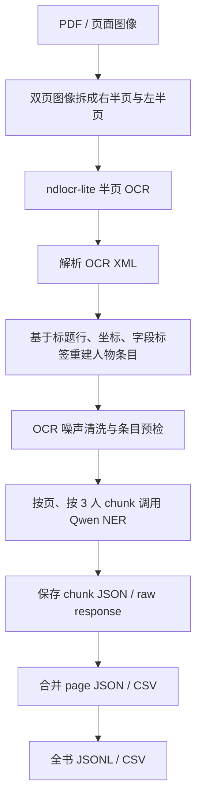

# 从版面切分到 NER：用 AI 辅助构建《満洲紳士録》历史人物资料处理流程

本文档梳理我在本工作区中，借助 OpenClaw 与 Codex 逐步完成《満洲紳士録》从 PDF 图像、版面切分、OCR、数据清洗到 NER 结构化抽取的全过程。它不是一份“最终代码说明书”，而是一份面向同门展示的研究过程复盘：我如何提出方案、如何发现问题、如何定位问题来自哪一个环节，又如何把失败结果转化为下一版流程的优化依据。

项目工作区：`AItools-for-historyresearch`

核心处理对象：`manshu` 史料 PDF，即《満洲紳士録》类日文竖排人物名录资料。

核心目标：在尽量减少人工标注的前提下，建立一个可复现、可扩展、可质检的历史人物资料抽取流程。

## 一、研究任务与困难

这项工作的目标并不是简单地把 PDF 转成文本，而是要把一本竖排日文人物名录转成可供历史研究使用的结构化资料。最终希望每个人物条目至少能够抽取出姓名、出生、本籍、学历、经历、现职、家庭、住址、组织流动、地域流动等信息。

这本史料有几个非常典型的技术难点：

| 难点 | 具体表现 | 对流程的影响 |
|---|---|---|
| 双页扫描 | 一个图像文件往往包含左右两页 | 不能直接把整张图当作单页 OCR |
| 竖排多栏 | 文本从右向左、每页多栏排列 | 横向切块会切断人物履历 |
| 人物条目密集 | 一个页面包含十几到二十多个小传 | NER 容易把相邻人物混合 |
| 字段标签不稳定 | `出生`、`本籍`、`經歴`、`家族`、`住所` 等常被 OCR 误识 | 需要在 OCR 后做规则修复 |
| 历史日文/旧字体 | `滿`、`鐵`、`總`、`經`、`勳` 等旧字频繁出现 | 通用 OCR 与通用 NER 都容易漏识 |
| 无人工标注语料 | 不能训练一个监督模型 | 必须依赖流程设计、规则质检和小样本测试 |

因此，这个项目的关键判断是：问题不能被简化为“找一个更强的 OCR”或“换一个更强的 NER prompt”。真正的瓶颈是流程链条中多个环节互相影响：

```text
版面切分 -> OCR -> OCR 后清洗 -> 人物条目重构 -> NER prompt -> 结构化输出 -> 质检
```

只要前面的版面切分错了，后面的 OCR 会读错；只要 OCR 把两个人混在一起，NER 即使足够强，也只能在混乱输入里补救；只要 NER prompt 没有要求保留证据文本和质量标记，最终结果就难以回溯。

## 二、整体工作思路

我的总体设计原则可以概括为四点：

| 原则 | 说明 |
|---|---|
| 先定位错误来源，再优化模型 | 不直接把问题归咎于 NER，而是逐层检查切分、OCR、清洗、条目划分 |
| OCR 尽量本地完成 | 中间 OCR 使用 `ndlocr-lite`，降低大规模处理成本 |
| NER 小样本先验证 | 先用单页或小范围测试 prompt 与结构，再决定是否全书运行 |
| 每一步都保留中间产物 | 保留图像切分、OCR XML/TXT、清洗条目、NER prompt、raw response、JSON/CSV |

这个原则背后的研究考虑是：历史资料处理不只是追求“自动化”，更重要的是可解释、可复核、可回退。尤其是人物名录类史料，一条错误的履历混入另一个人物，后续史实分析就可能被污染。因此流程必须能够告诉我们：错误到底发生在切图、OCR、清洗，还是 NER。

## 三、第一阶段：早期流程与初步成果

在 OpenClaw 协助下，工作区中已经形成了若干早期脚本与输出。这些尝试非常重要，因为它们提供了第一批可观察的失败样本。

早期主要产物包括：

| 产物 | 说明 |
|---|---|
| `ocr_output/full_pages/images` | 已将 PDF 转成页面图像，共约 888 页 |
| `ocr_output/full_pages/split` | 早期三块切分结果，约 2664 个 block 图像 |
| `ocr_output/full_pages/ocr` | 对三块切分图像运行 `ndlocr-lite` 后得到的 XML/JSON/TXT |
| `scripts/split_double_page.py` | 早期双页切分脚本 |
| `scripts/run_ocr_221_230.py` | 针对 221-230 页的 OCR 测试脚本 |
| `scripts/layout_aware_page_splitter.py` | 后续尝试的版面感知切分脚本 |
| `scripts/ner_single_page.py`、`scripts/ner_stage3_v2.py`、`scripts/ner_resume.py` | 早期 NER 与断点续跑脚本 |

这些尝试说明了一件事：单纯“切块 + OCR + NER”在形式上可以跑通，但结果并不一定可靠。早期的 `biography_data*.json/csv` 输出中出现了一些典型问题：

| 问题 | 表现 |
|---|---|
| 假实体 | 将 `姓名`、页眉、数字、残片误识为人物 |
| 混合条目 | 一个人物条目中混入下一人物的官职或住址 |
| 断裂履历 | 履历被切块边界切断，NER 只能抽到残缺经历 |
| 页面顺序混乱 | 双页、竖排、多栏之间的阅读顺序没有被稳定恢复 |
| prompt 与输入不匹配 | NER prompt 要求很细，但 OCR 文本本身缺失严重 |

这一阶段最重要的收获不是得到最终数据，而是暴露了“版面切分方式”是全流程的上游瓶颈。

## 四、第二阶段：重新审视版面切分

最初的问题是：不同切分方式得到的 OCR 与 NER 结果不一致。为了判断哪种切分更合理，我比较了几类方案。

| 方案 | 做法 | 结果 |
|---|---|---|
| 整页 OCR | 直接对双页图像 OCR | 双页混读，阅读顺序难以控制 |
| 三块切分 | 将双页按若干竖向区域切成 3 块 | 比整页好，但仍会切断栏或混入相邻页 |
| 六块横向切分 | 将页面切成上中下等区域 | 对竖排文本很不友好，会把竖排栏腰斩 |
| layout-aware 横向/区域切分 | 尝试根据版面自动找块 | 个别页切分高度异常，漏掉大量文字 |
| 左右半页切分 | 先将双页拆成右页、左页，再分别 OCR | 最稳定，最符合原书阅读结构 |

关键发现是：这本书的扫描图像本质上是“双页展开图”，但每一页内部是竖排多栏。横向切割会破坏竖排栏，哪怕 OCR 本身很强，也会读到被截断的行。相比之下，先把双页切成左右半页，再对半页运行 OCR，是更符合书籍物理结构的方案。

因此，流程设计发生了一个关键转向：

```text
旧思路：双页图像 -> 多块切分 -> OCR -> 合并

新思路：双页图像 -> 右半页/左半页 -> 半页 OCR -> 根据 XML 坐标重建条目
```

这个转向看似简单，但它解决的是上游结构性错误。

## 五、第三阶段：从 OCR 文本转向 OCR XML

早期流程主要依赖 OCR 后的纯文本。但纯文本丢失了很多版面信息，例如每一行的位置、顺序、置信度、是否被 OCR 判断为标题等。

后来我改为直接解析 `ndlocr-lite` 生成的 XML。这样可以利用以下信息：

| XML 信息 | 用途 |
|---|---|
| `LINE STRING` | OCR 文本内容 |
| `LINE TYPE` | 判断是否为标题或正文 |
| `ORDER` | 恢复 OCR 内部阅读顺序 |
| `X/Y/WIDTH/HEIGHT` | 判断竖排栏位置与标题形态 |
| `CONF` | 记录置信度，辅助质检 |
| `TEXTBLOCK` | 识别 OCR 自动分出的文本块 |

对应的核心脚本是：

```text
scripts/manshu_xml_entry_pipeline.py
```

它完成的任务包括：

| 功能 | 说明 |
|---|---|
| 半页切分 | 将双页图像裁成右页和左页 |
| 半页 OCR 调用 | 调用 `ndlocr-lite` 处理半页图像 |
| XML 解析 | 读取每个 OCR line 的文本和坐标 |
| 人物标题识别 | 根据 `タイトル本文`、高度、宽度、姓名模式判断人物名 |
| 条目重构 | 从标题行开始，将后续行归入同一人物 |
| 前置官职归属 | 将姓名前的官职/头衔行归入正确人物 |
| OCR 噪声归一 | 修复常见字段标签误识 |
| 预检标记 | 标记短条目、字段过少、重复核心字段、低置信度等 |

## 六、第四阶段：第 217 页作为诊断页

第 217 页在调试中起到了“显微镜”的作用。它能够清楚暴露不同流程的效果差异。

在旧的三块 OCR 来源下，第 217 页虽然能重建出约 22 条人物，但仍存在混合、截断和字段错位。后来使用半页 OCR 后，第 217 页仍然是 22 条人物，但 review 数显著下降，且若干人物的早期经历和地址被恢复。

典型变化包括：

| 人物/现象 | 旧流程问题 | 半页 OCR 后改进 |
|---|---|---|
| 徳永繁吉 | 履历混入、字段残缺 | 经历事件显著增加，组织流动更完整 |
| 小林五郎 | 早稻田、铁道省、满铁等经历漏掉 | 早期经历恢复 |
| 伊藤硯太郎 | 地址尾巴误归给下一人 | 地址归属修正 |
| 页面整体 | NER 只抽到少量人物或混合人物 | 条目边界更清楚 |

这个阶段得出的结论是：NER 结果差，并不一定是 NER prompt 的问题。很多时候是 OCR 输入已经混乱，模型只是在错误输入上“努力解释”。

## 七、第五阶段：NER prompt 与结构化输出

在 NER 阶段，我的目标不是只抽出姓名，而是让模型输出可研究的履历结构。因此 prompt 逐步向以下方向优化：

| 结构 | 目的 |
|---|---|
| `person_info` | 保存姓名、出生、本籍等基础信息 |
| `current_status` | 保存现职、机构、职责 |
| `education` | 保存学歴 |
| `career_trajectory` | 按时间/组织/职位/地点记录履历 |
| `trajectory_summary.organization_flow` | 总结组织流动 |
| `trajectory_summary.location_flow` | 总结地域流动 |
| `family_raw`、`address_raw` | 保留原文信息，减少过度解释 |
| `needs_review`、`review_reason` | 标记 OCR 或抽取不确定处 |
| `evidence_text` | 为结构化字段保留证据文本 |

这里的一个重要选择是：NER 输出要求 JSON，而 CSV 由程序根据 JSON 再生成。原因是直接要求模型同时输出 JSON 和 CSV 容易增加格式错误，而 JSON 更适合作为主数据格式。

## 八、第六阶段：解决 Qwen NER 的超时与成本问题

在最初测试中，整页一次性发送给 Qwen 会出现请求过大、响应慢甚至超时的问题。后来改为“页内分块”：

```text
一页人物条目 -> 每 3 条一个 chunk -> 分别调用 Qwen -> 合并 page result
```

这样做有几个好处：

| 好处 | 说明 |
|---|---|
| 降低超时风险 | 每次 prompt 更短 |
| 降低漏抽风险 | 模型注意力集中在少量人物上 |
| 支持断点续跑 | 每个 chunk 单独保存 JSON |
| 便于定位错误 | 可以知道是哪一页哪一块失败 |
| 控制 API 成本 | 可以先测试一页或几页 |

后来完整流程脚本加入了费用保护：

```text
--confirm-ner-cost
```

如果对多页运行 NER，必须显式加这个参数，避免误触发大规模 API 调用。

## 九、第七阶段：全流程脚本化

在前面调试的基础上，我将完整流程封装为：

```text
scripts/manshu_full_workflow.py
```

它把全书级处理拆成四个阶段：

| stage | 功能 |
|---|---|
| `ocr` | 对每页图像进行左右半页切分，并运行 `ndlocr-lite` |
| `entries` | 解析 OCR XML，清洗文本，重建人物条目 |
| `ner` | 按页、按 chunk 调用 Qwen NER |
| `merge` | 合并每页 NER 输出为 JSONL/CSV |

可复现命令示例：

```powershell
python .\scripts\manshu_full_workflow.py --stage ocr --start-page 1 --end-page 888 --run-ocr --output-dir .\ocr_output\manshu_full_pipeline
```

```powershell
python .\scripts\manshu_full_workflow.py --stage entries --start-page 1 --end-page 888 --output-dir .\ocr_output\manshu_full_pipeline
```

```powershell
python .\scripts\manshu_full_workflow.py --stage ner --start-page 1 --end-page 888 --output-dir .\ocr_output\manshu_full_pipeline --ner-chunk-size 3 --model qwen3.6-plus --confirm-ner-cost --continue-on-error
```

```powershell
python .\scripts\manshu_full_workflow.py --stage merge --start-page 1 --end-page 888 --output-dir .\ocr_output\manshu_full_pipeline
```

输出目录设计如下：

```text
ocr_output/manshu_full_pipeline/
  split_halves/
  ocr_halves/
  pages/
  ner/
  merged/
  logs/
```

这种目录结构保证每个环节都可检查、可回溯。

## 十、第八阶段：211-215 页小范围全流程验证

为了验证流程能否从单页扩展到小范围，我运行了 211-215 页的全流程。

第一轮结果暴露出一个关键问题：清洗阶段重建出 90 条人物条目，但 NER 输出 99 人。这说明问题不是 NER “乱抽”，而是部分 OCR 条目里已经混入多个真实人物，Qwen 按 prompt 把它们拆了出来。

典型混合包括：

| 页码 | 混合情况 |
|---|---|
| 213 | `高橋匡四郎` 与 `田村彦藏` 被混在同一条 |
| 214 | `初治漢` 与 `松村勇夫` 混合 |
| 214 | `石井保吉` 与 `窪田五六` 混合 |
| 215 | `石田又次`、`市川重三郎`、`犬丸春美` 混合 |
| 215 | `鬼頭常太郎`、`景鐘彥`、`岡村隆一` 混合 |

这促使我进一步优化分条规则。关键修正包括：

| 问题 | 修正 |
|---|---|
| `市場元` 被当作地名而非人名 | 允许人名中出现 `市`、`村` 等字 |
| `松村勇夫` 被识别为正文而非标题 | 放宽基于几何形态的标题行判断 |
| `窪田五六` 因数字汉字被判为地址 | 增加“姓氏 + 一到两个数字汉字”的人名例外 |
| `調布三八二三` 被误判为人名 | 继续排除含明显地址/电话模式的行 |
| `官職 + 出生` 行排在姓名前 | 将这类前置官职归入下一人物 |

修补后，211-215 页结果变为：

| 页码 | 清洗条目数 | 清洗 review | NER 输出人物数 |
|---|---:|---:|---:|
| 211 | 19 | 0 | 19 |
| 212 | 19 | 0 | 19 |
| 213 | 21 | 0 | 21 |
| 214 | 21 | 0 | 21 |
| 215 | 21 | 0 | 21 |
| 合计 | 101 | 0 | 101 |

这说明修补后的流程达到了一个重要状态：

```text
OCR 后条目数 = NER 输出人物数
```

它不代表每个字段都绝对正确，但说明“人物边界”这一核心问题已经大幅稳定。

对应输出：

```text
ocr_output/manshu_full_pipeline_211_215_resplit/
  merged/entries_0211_0215.jsonl
  merged/entries_summary_0211_0215.csv
  merged/ner_persons_0211_0215.jsonl
  merged/ner_persons_0211_0215.csv
```

## 十一、第九阶段：寻找本地日文 OCR 替代模型

为了确认 `ndlocr-lite` 是否仍是最佳 OCR 选择，我又在 GitHub 等开源平台调研并测试了几个可本地部署的日文 OCR 候选。

候选包括：

| 模型/工具 | 特点 |
|---|---|
| `PaddleOCR` | 多语言 OCR，PP-OCRv5 mobile 较轻，可本地部署 |
| `RapidOCR` | ONNXRuntime 推理，部署轻，速度快 |
| `EasyOCR` | 安装简单，支持多语言 |
| `manga-ocr` | 日文漫画/竖排文字识别较强，但不负责版面检测 |
| `Tesseract jpn_vert` | 传统 OCR，可支持日文竖排，但本机未安装 `tesseract.exe` |

测试对象限定为第 211 页，只评价 OCR，不使用大模型 API，也不做 NER。

测试脚本：

```text
scripts/evaluate_japanese_ocr_page211.py
```

测试结果：

| OCR | 部署状态 | 第 211 页耗时 | 姓名命中 | OCR 评价 |
|---|---:|---:|---:|---|
| `ndlocr-lite` 半页基线 | 已有 | 未重跑，仅统计既有结果 | 19/19 | 目前仍明显最好 |
| `PaddleOCR PP-OCRv5 mobile` | 已本地跑通 | 24.6s | 11/19 | 候选中最好，但仍漏姓名与字段 |
| `RapidOCR ONNXRuntime` | 已本地跑通 | 21.9s | 8/19 | 很轻、快，但旧日文竖排效果不足 |
| `EasyOCR` | 已本地跑通 | 46.9s | 0/19 | 本页基本碎片化 |

字段命中也说明了差异：

| OCR | `出生` | `本籍` | `經歴/経歴` | `住所` |
|---|---:|---:|---:|---:|
| `ndlocr-lite` | 18 | 14 | 14 | 16 |
| `PaddleOCR` | 10 | 10 | 0 | 1 |
| `RapidOCR` | 19 | 9 | 0 | 1 |
| `EasyOCR` | 0 | 0 | 0 | 0 |

结论是：当前全书主流程仍应使用 `ndlocr-lite`。`PaddleOCR` 可以作为辅助复核模型，但不适合直接替代。`RapidOCR` 与 `EasyOCR` 不适合这本书的主 OCR。

## 十二、这次工作中的方法论收获

这次流程迭代最重要的经验，不是“某个模型最好”，而是以下几点。

### 1. 历史资料处理首先是版面问题

如果版面顺序错了，后续模型会在错误输入上做“合理化解释”。早期很多 NER 问题，其实是切分导致的。比如横向切分把竖排栏切断，OCR 文本自然会缺句、断句、混栏。

### 2. 不要只看最终 JSON，要看中间产物

我保留了图像切分、OCR XML、OCR TXT、清洗条目、NER prompt、raw response、最终 JSON/CSV。这样当发现 NER 漏人时，可以回头检查是 OCR 漏了、条目合并了，还是 prompt 没要求。

### 3. 小样本测试比全书盲跑更有效

第 217 页和 211-215 页起到了“样本实验室”的作用。通过小范围验证，可以在花费较低的情况下定位问题。等人物边界稳定后，再扩大全书处理才有意义。

### 4. LLM 不应该承担所有清洗任务

如果把混乱 OCR 文本直接交给 NER，模型会做很多猜测。更好的做法是先用规则和版面信息把人物边界整理干净，再让 LLM 做语义抽取。

### 5. `needs_review` 是历史研究中的必要字段

历史资料中不能把不确定结果伪装成确定事实。无论是 OCR 乱码、字段缺失还是时间推断，都应该在结构化结果中保留 review 标记和证据文本。

## 十三、当前最终流程

当前推荐流程如下：



核心代码：

| 文件 | 作用 |
|---|---|
| `scripts/manshu_xml_entry_pipeline.py` | 半页 OCR、XML 解析、条目重构、单页 NER |
| `scripts/manshu_full_workflow.py` | 全书级 `ocr/entries/ner/merge` 编排 |
| `scripts/evaluate_japanese_ocr_page211.py` | 本地 OCR 模型对比测试 |

全书 OCR 与清洗：

```powershell
python .\scripts\manshu_full_workflow.py --stage ocr --start-page 1 --end-page 888 --run-ocr --output-dir .\ocr_output\manshu_full_pipeline
```

```powershell
python .\scripts\manshu_full_workflow.py --stage entries --start-page 1 --end-page 888 --output-dir .\ocr_output\manshu_full_pipeline
```

小范围 NER：

```powershell
python .\scripts\manshu_full_workflow.py --stage ner --start-page 211 --end-page 215 --output-dir .\ocr_output\manshu_full_pipeline --ner-chunk-size 3 --model qwen3.6-plus --confirm-ner-cost --continue-on-error
```

合并结果：

```powershell
python .\scripts\manshu_full_workflow.py --stage merge --start-page 211 --end-page 215 --output-dir .\ocr_output\manshu_full_pipeline
```

## 十四、向同门展示时可以强调的点

如果把这项工作讲给同门，我会重点讲以下几点：

| 展示重点 | 可以说明的问题 |
|---|---|
| AI 不是“一键替代人工” | 它需要被放在一个可控流程中 |
| 版面切分比 prompt 更基础 | 错误输入会导致再好的 prompt 也失效 |
| 小样本诊断很关键 | 先用一页或五页发现问题，比全书盲跑更有效 |
| 中间产物是研究证据 | 每个结构化字段都应能回到 OCR 文本 |
| 规则和 LLM 应该分工 | 规则处理边界和格式，LLM 处理语义 |
| review 字段体现史学谨慎 | 不确定的地方要被标出，而不是被模型“润色”掉 |

这套流程的价值不只是处理《満洲紳士録》这一本书，也提供了一种可迁移的方法：面对复杂历史文献，不是直接问模型“帮我抽取”，而是先把史料的版面结构、信息结构、错误类型、验证方式拆开，然后让不同工具在合适的位置发挥作用。

## 十五、后续计划

下一步可以继续做几件事：

| 方向 | 说明 |
|---|---|
| 全书 OCR 与 entries 阶段先跑完 | 这部分不涉及大模型 API，成本低 |
| 统计全书 review 分布 | 找出最容易出错的页码和版面类型 |
| 分段运行 NER | 例如每次 50 页，避免长任务中断 |
| 对高 review 页抽样复查 | 用原图、OCR XML、NER raw response 对照 |
| 增加字段级质量指标 | 统计姓名、出生、本籍、經歴、住所等字段缺失率 |
| 建立可视化检查工具 | 将 OCR 框、条目边界、NER 输出并排显示 |

## 十六、总结

这项工作最终形成的不是一个简单脚本，而是一套历史资料处理方法：

```text
先理解史料版面 -> 再设计切分 -> 再 OCR -> 再清洗条目 -> 再做 NER -> 最后质检回溯
```

从早期失败结果到最终小范围闭环，最关键的转变是：我不再把问题理解为“模型能力不足”，而是把它拆成一条可诊断的处理链。每一次错误都被用来回答一个更具体的问题：是页面切错了？OCR 漏了？条目混了？prompt 没约束？还是模型在不确定处做了推断？

这种工作方式，正是 AI 辅助历史研究最值得保留的部分：不是把判断交给 AI，而是用 AI 和代码把史料处理过程变得更系统、更透明、更可复查。
