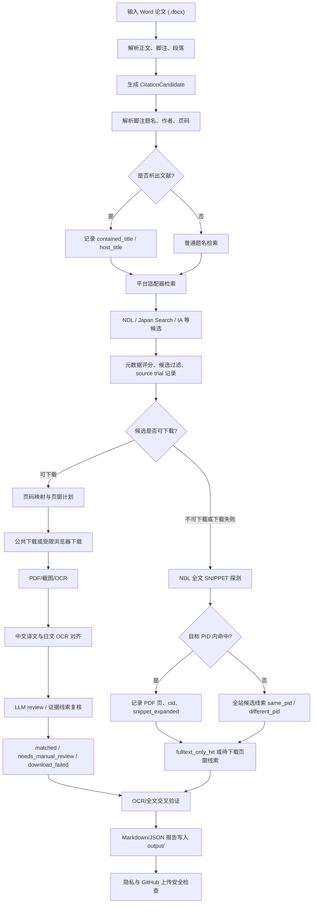
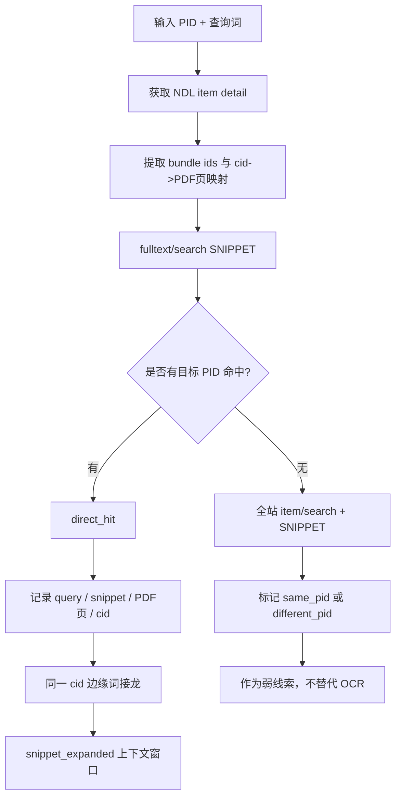
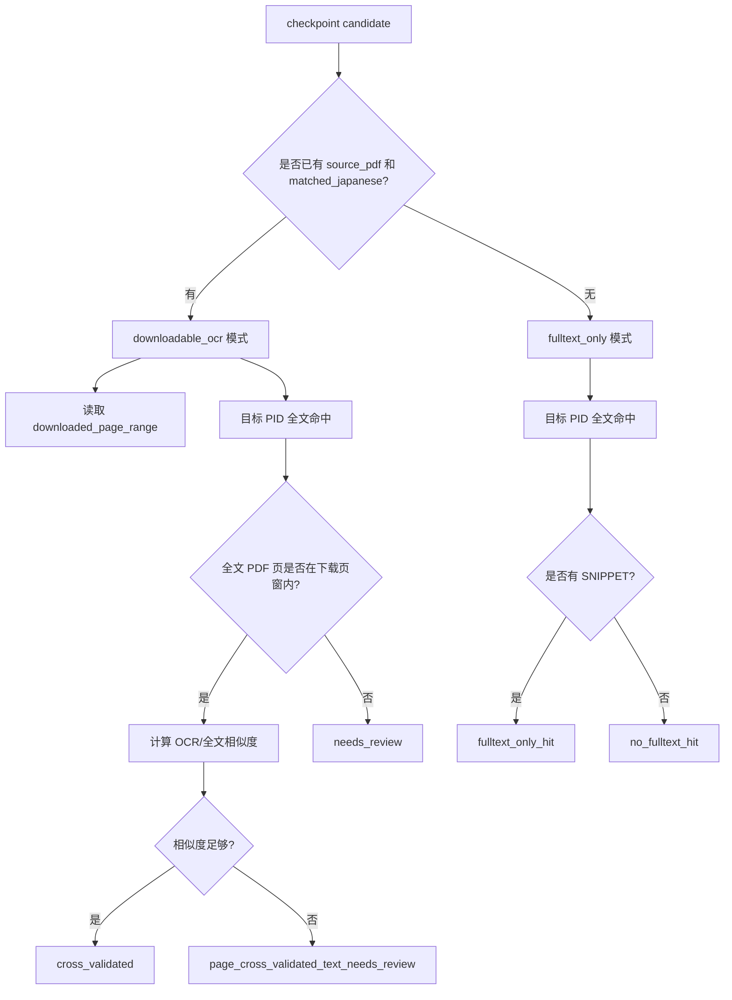
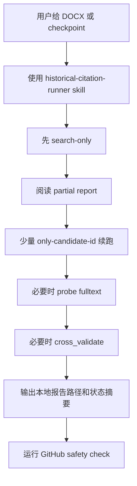

# history-citation 模块使用流程图

## 总体流程

## NDL 全文命中证据流

## OCR 与全文交叉验证

## 小模型安全调用流程

## 证据等级

| 等级 | 状态 | 说明 |
| --- | --- | --- |
| 强 | `matched`, `cross_validated` | 已下载/OCR，且全文或对齐证据支持 |
| 中 | `page_cross_validated_text_needs_review` | 页窗一致，但 OCR/全文文本仍需人工看版面 |
| 弱 | `fulltext_only_hit` | NDL 全文片段能定位 PDF 页，但未下载/OCR |
| 线索 | `same_pid` / `different_pid` global candidate | 全站全文搜索线索，不能代替目标书证据 |
| 未定 | `source_unavailable`, `source_not_found`, `page_mapping_unavailable` | 平台或页码条件不足，需补查 |
